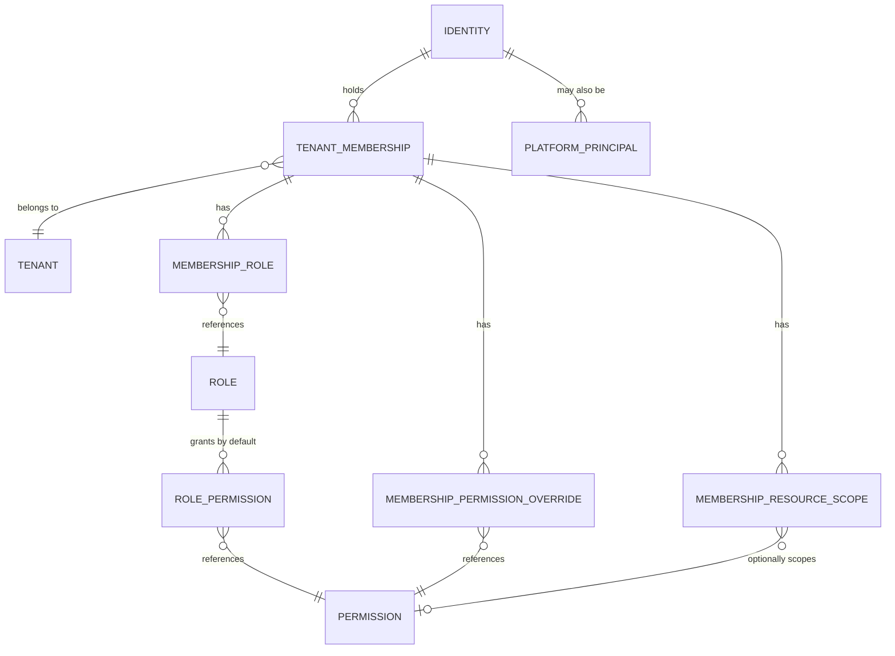
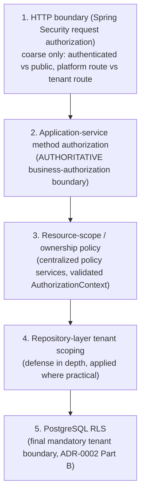

# Authorization Model

**Status: Accepted, 2026-08-05** — this document is the detailed
architecture reference for `docs/adr/ADR-0010-authorization-model.md`,
which is the governing decision record. This document does not itself
carry ADR status; if the two ever appear to disagree, ADR-0010 is
authoritative and this document should be corrected to match it, not
the other way round.

**This document describes the accepted target architecture and the shape
of the in-progress implementation.** As of Wednesday, August 5, 2026,
the repository already contains the first real backend slice under
`backend/`: initial auth endpoints, JWT issuance/validation,
tenant-membership context validation, RLS wiring, schema migrations, and
supporting tests. The full authorization catalog, migration of legacy
permission state, complete module coverage, and the broader
authorization-enforcement test suite do **not** exist yet. This
document remains the target reference for that remaining work.

## 1. Principal And Membership Model

Two authorization domains exist, deliberately separate:

- **Platform domain**: platform administrators, scoped to Workin's own
  operation of the system itself (approving/suspending companies,
  platform-wide oversight). A platform principal's privileges never
  imply tenant business-data access.
- **Tenant domain**: every company's own users. A single human identity
  may hold **multiple, independent tenant memberships** (e.g. one person
  who is `COMPANY_ADMIN` at company A and also an `EMPLOYEE` at company
  B) — roles, permissions, and resource scopes belong to the
  **membership**, never globally to the identity.



**Fixed tenant role categories** (business-level defaults, not the
authorization source of truth by themselves):

| Role | Legacy equivalent |
|---|---|
| `COMPANY_ADMIN` | `company_admin` (`UserRoleEnum`), dashboard `doCompanyLogin()` |
| `HR` | `hr` (`UserRoleEnum`), dashboard `doHrLogin()` |
| `MANAGER` | `manager` (`UserRoleEnum`) — see §3 on why this role alone is not sufficient for scope |
| `EMPLOYEE` | `employee` (`UserRoleEnum`) |

**Employee self-service is not a separate security domain.** It is the
`EMPLOYEE` role's default resource scope: restricted to the caller's own
employee record. No parallel enforcement path exists for it — it uses
the same membership/role/permission/scope machinery as every other
role, just with a narrower default scope.

**Manager visibility is never inferred from the `MANAGER` role alone.**
It is represented by one or more explicit `membership_resource_scope`
rows, each with a `scope_type` of:

- `COMPANY` (rare, only if a manager is deliberately given company-wide
  visibility)
- `BRANCH`
- `DEPARTMENT`
- `DIRECT_REPORTS`
- `EMPLOYEE` (specifically assigned individuals)

Legacy `hr-legacy` grants the `manager` role unscoped company-wide
attendance visibility and request-approval rights today
(`hr-legacy#17`, `#18`) — confirmed to be zero real employees with
`role='manager'` in production data at the time this was investigated,
and the mobile client's own "Manager Mode" is an unimplemented stub
(`profile_manager_mode_button.dart`). **Migration does not preserve
this unscoped access by default.** Each manager's intended scope must
be resolved individually before migration (see Required Implementation
Task 3) and expressed as explicit `membership_resource_scope` rows —
never as a blanket "managers see everything" rule baked into code.

## 2. Tenant-Membership Validation

RLS (`docs/adr/ADR-0002-modular-monolith-baseline.md` Part B, Accepted)
is the mandatory **data-layer** isolation mechanism. It is not a
substitute for **application-level** membership validation — a caller
proving *who* they are is not the same as proving *which membership,
in which tenant, they are validly acting as* right now.

### Required per-request sequence

```mermaid
sequenceDiagram
    participant C as Client
    participant A as App (Service Layer)
    participant D as Database (RLS)
    C->>A: Request + JWT (sub, membership_id, tenant_id)
    A->>A: 1. Authenticate identity/session (ADR-0005)
    A->>A: 2. Resolve requested tenant_id + membership_id
    A->>D: 3. Load membership server-side (by membership_id)
    A->>A: 4. Verify: membership belongs to identity; belongs to\n   requested tenant; is active; tenant/employee active
    A->>A: 5. Build immutable AuthorizationContext
    A->>D: 6. BEGIN transaction; SET LOCAL app.current_company_id = tenant_id
    A->>D: 7. Execute business operation (RLS enforces final boundary)
    D-->>A: Result (already tenant-filtered by RLS)
    A-->>C: Response
```

1. Authenticate the identity and session (per ADR-0005).
2. Resolve the requested `tenant_id` and `membership_id` from the
   request (header/URL/JWT claim — see §6, these are **selectors**, not
   proof).
3. Load the membership server-side, from the database, not from the
   token.
4. Verify, all four, every request:
   - the membership belongs to the authenticated identity
   - the membership belongs to the requested tenant
   - the membership is active
   - the tenant and employee account are active where applicable
5. Build an **immutable** `AuthorizationContext` from the validated
   server-side data (membership, effective roles, effective
   permissions, resource scopes) — nothing downstream re-derives or
   trusts client-supplied claims again for this request.
6. `SET LOCAL app.current_company_id` inside the **same** database
   transaction as the business operation (matches the H2 spike's proven
   pattern exactly — transaction-scoped, resets automatically).
7. Let PostgreSQL RLS enforce the final data boundary.

### Fail-closed requirement

The mechanism **must** fail closed — deny, not silently pass — when:

- no tenant is selected
- the membership does not exist
- the membership is disabled
- the identity and membership do not match
- the RLS session variable is absent (this is F-13's exact test —
  see `docs/migration/technical-spike-plan.md`'s "Full Spike Findings")
- the operation executes outside a valid tenant transaction

The dedicated non-superuser runtime database role (`app_runtime`,
proven in the H2 spike) remains a **hard architectural requirement** —
not optional hardening. A startup check must fail loudly if the
runtime DataSource ever connects as a superuser (Required Implementation
Task 9).

## 3. Roles And Permissions

**Hybrid RBAC + capability-permission model.** Roles give
understandable business-level defaults; permissions give granular,
independently assignable capabilities. This explicitly does **not**
reproduce the legacy `hr_permissions` design (17 hardcoded boolean
columns, one table, one row per HR-role employee — see §7 for the
corrected, evidence-confirmed count and the full legacy mapping).

### Schema (normalized)

| Table | Purpose |
|---|---|
| `permissions` | The canonical catalog. One row per stable, namespaced capability key (e.g. `employees.read`). Single source of truth — no permission string may be introduced anywhere else in the codebase without a corresponding row here. |
| `role_permissions` | Default permission bundle per fixed role (`COMPANY_ADMIN`/`HR`/`MANAGER`/`EMPLOYEE`). |
| `tenant_memberships` | One row per (identity, tenant) pair — the anchor for everything else in this section. |
| `membership_roles` | Role(s) held by a specific membership. |
| `membership_permission_overrides` | Per-membership explicit `ALLOW`/`DENY` on a specific permission — used to migrate the legacy per-employee `hr_permissions` matrix and to support legitimate individual exceptions going forward. |
| `membership_resource_scopes` | Per-membership resource-scope assignments (`COMPANY`/`BRANCH`/`DEPARTMENT`/`DIRECT_REPORTS`/`EMPLOYEE`), optionally tied to a specific permission. |

### Permission key naming

Stable, namespaced, lowercase, dot-separated: `<domain>.<capability>`,
e.g. `employees.read`, `employees.manage`, `attendance.read`,
`attendance.correct`, `payroll.read`, `payroll.run`,
`requests.approve`, `company.settings.manage`. The full canonical
catalog derived from real legacy evidence is in §7.

### Precedence (deterministic, evaluated in this order)

1. **Explicit deny** (a `membership_permission_overrides` row with
   effect `DENY`) — wins over everything below.
2. **Explicit allow** (a `membership_permission_overrides` row with
   effect `ALLOW`) — wins over role-granted.
3. **Role-granted permission** (via `membership_roles` →
   `role_permissions`).
4. **Deny by default** — no matching rule anywhere means no access.

### Permission possession ≠ resource scope

These are two separate checks, always. Holding `attendance.read` does
**not** by itself allow reading attendance for every employee in the
tenant — the caller's `membership_resource_scopes` rows determine
*which* employees' attendance that permission actually reaches. A
`COMPANY_ADMIN`'s default scope is typically `COMPANY`-wide; a
`MANAGER`'s scope is whatever was explicitly assigned per §1.

**Implementation status (2026-08-08 — F-16/F-25 shipped).** This is
now built, not future work. `membership_resource_scopes` (schema V31,
RLS V32) plus `ResourceScopeService`
(`com.workin.backend.authorization`, enforcement boundary 3 below)
realize it with a **role-based fallback** model chosen by the
repository owner (D-029/D-030): a membership is *scope-limited* iff it
holds `MANAGER` and neither `COMPANY_ADMIN` nor `HR` (a company-wide
role always trumps), so `COMPANY_ADMIN`/`HR` keep company-wide reach
with **no** scope rows — the "COMPANY-wide default" above is expressed
as this role fallback, not as stored `COMPANY`-type rows. A
scope-limited membership with no scope rows reaches **zero** employees
(deny-by-default). Enforcement is live across every caller-facing
employee-data surface (attendance, requests, penalties, advances,
salary-contracts, leave-balances, payslips, employees), each applying
the same `isEmployeeInScope`/`scopedEmployeeIdsOrNull` guard;
`ManagerScopeFlowTest` proves it per module. **Scope types
implemented:** `BRANCH`, `DEPARTMENT`. **Deferred (F-25):**
`DIRECT_REPORT`, `EMPLOYEE` — no consumer yet. **Recorded
simplification:** scope rows are permission-agnostic in this
iteration (they gate all scoped operations, not one permission — the
`optionally scopes` edge in §1's diagram is not yet used).
`employees.create` is deliberately not scope-gated (a new employee has
no branch/department at creation). Batch-level payroll operations are
company-wide by nature and gated by `payroll.run`, not by resource
scope (see the 2026-08-08 coverage note in
`docs/superpowers/specs/2026-08-07-manager-scope-remaining-modules-design.md`).

### No external policy engine for this MVP

OPA, Cedar, OpenFGA, Keycloak Authorization Services, or an equivalent
external policy engine are **explicitly not adopted**. The real,
confirmed complexity of this system (4 roles, a low-double-digit
permission catalog, resource scopes bounded to 5 categories) does not
justify the added operational and conceptual overhead of an external
policy engine — see ADR-0010's Alternatives Considered.

## 4. Structural Enforcement Boundaries

**Layered enforcement, one authoritative layer.** No layer is ever
documented or relied upon as a replacement for another.



1. **HTTP boundary**: Spring Security request authorization for coarse
   controls only — authenticated vs. public, platform route vs. tenant
   route, broad principal type. Controller route checks are **never**
   sufficient business authorization on their own.
2. **Application-service boundary — the authoritative layer.** Spring
   Security method authorization on application use cases. Use
   framework-native method security, centralized authorization-policy
   components, custom composed annotations or typed permission
   constants, and explicit resource-scope evaluation — not raw
   permission strings or complex authorization expressions scattered
   across the codebase. **Every externally reachable application-service
   operation must declare either its required authorization policy or
   an explicit marker that it is intentionally public/authentication-only.**
   An architecture test (ArchUnit, per `docs/testing/test-strategy.md`'s
   stack) must fail the build when an externally reachable use case has
   no authorization declaration (Required Implementation Task 10).
   Controllers delegate authorization-sensitive decisions to this layer
   — they never reproduce business checks themselves.
3. **Resource-scope and ownership policy**: resource ownership and
   manager scope checked through centralized policy services using the
   already-validated `AuthorizationContext` — never re-derived ad hoc
   per controller/service. **Implemented** by `ResourceScopeService`
   (2026-08-08, F-16/F-25) — the single reusable guard every
   employee-data service calls (see §3's implementation-status note).
4. **Repository-layer tenant scoping**: retained where practical, as
   defense in depth — consistent with the H2 spike's recommendation
   (`docs/adr/ADR-0002-modular-monolith-baseline.md` Decision, condition
   2).
5. **PostgreSQL RLS**: the final, mandatory tenant boundary, including
   protection against an accidentally unscoped repository query — this
   is what the H2 spike proved and what condition 1/3 of ADR-0002's
   Decision require to hold in practice.

## 5. Effect Of Membership, Role, And Permission Changes

**Membership deactivation, role changes, permission revocation, and
resource-scope changes take effect on the next request** — never
dependent on access-token expiry, refresh, logout, or re-login.

> **Platform administrators are covered by the same rule (D-145, 2026-08-31).**
> This section and §6 are written in tenant terms — membership, roles, resource
> scopes — and platform admins have none of those, which left it ambiguous
> whether "next request" applied to them. It does: `PlatformAdminAuthenticationFilter`
> loads the `platform_admins` row and verifies `active` on every request, so
> **deactivating a platform admin takes effect immediately** rather than at
> token expiry. It did not, until R-026 was closed — a deactivated admin kept
> access for up to 900s.
>
> One exception, and it is shared with the tenant path rather than special to
> platform admin: **logout** revokes only the refresh family. The access token's
> `sid` claim is issued and never read on either surface, so a logged-out token
> keeps working until `exp`. Whether this section's promise requires closing
> that is open — **R-027**, `docs/bootstrap/open-questions.md`, annotated on
> ADR-0005.

For the MVP:

- Load the active membership, effective permissions, and effective
  resource scopes **server-side, on each request** (step 3–5 of the
  §2 sequence).
- **No cross-request authorization cache** initially — correctness and
  immediate revocation are prioritized over an optimization nothing has
  yet measured a need for.
- **Request-local memoization is allowed** — the same authorization data
  should not be loaded repeatedly within a single request, only across
  requests.

A distributed cache may be introduced later, **only** when real
measurements justify it, and only with all of: an authorization
version, explicit invalidation on every authorization change, a bounded
TTL, multi-instance invalidation, and tests proving stale privileges
cannot survive a revocation. None of this is built now — this paragraph
is a future gate, not a current task.

**Relationship to ADR-0005**: authentication-session revocation remains
governed by ADR-0005 (short-lived access tokens, rotating refresh
tokens, server-side revocation) — that mechanism is unchanged by this
ADR. Authorization changes must **not** require revoking the complete
login session unless the membership itself is disabled or a security
incident requires it — a permission or scope change alone is handled by
the next request's server-side load, not by forcing re-authentication.

## 6. Authorization Data In Access Tokens

Access tokens remain **minimal identity and session credentials**. They
may carry context **identifiers**:

`sub`, `sid`, `jti`, `membership_id`, `tenant_id`, `iss`, `aud`, `iat`,
`exp`.

`membership_id` and `tenant_id` are **context selectors only** — they
tell the server which membership the caller *claims* to be acting as;
they are never treated as proof of active membership on their own (see
§2, steps 3–4, which always re-verify server-side).

**Never embedded in the token**: effective role list, permission list,
manager scope, branch scope, department scope. All effective
authorization data is loaded and validated server-side on every
request.

This deliberately accepts **one indexed authorization lookup per
request** in exchange for: immediate revocation, no stale permission
claims, simpler security reasoning, and consistent behavior across web
(the JTE platform-admin surface, ADR-0015), mobile, and desktop clients —
three real, independent frontends per
`docs/api/three-frontend-api-usage-matrix.md`, none of which can be
allowed to diverge in how fresh their authorization view is.

## 7. Legacy Permission Migration Table

**Corrected count, confirmed directly from `mysql_workin.schema.sql`
(`CREATE TABLE hr_permissions`), 2026-08-05: exactly 17 `can_*` boolean
columns, not 18.** The earlier "18 total... and one more" wording in
this repository's Discovery-stage notes was an overcount — a real
counting error, not a hedge to preserve now that it can be checked
directly. Real usage evidence for each flag was confirmed by reading
`dashboard/includes/hr_access.php` (`HrAccess` class — the single
enforcement point every flag routes through), `dashboard/includes/org_helper.php`
(`org_can_manage()`, confirmed to be a thin wrapper over the same
`HrAccess::canViewOrgSection()` check — legacy never distinguished
"view" from "manage" within a section, one flag granted both), and each
flag's real call sites.

| # | Legacy `hr_permissions` column | Real legacy scope (confirmed by code) | Canonical permission key(s) |
|---|---|---|---|
| 1 | `can_dashboard` | Gates only the `reports` nav item/page (`HrAccess::navPermissions()['reports']`) — despite the name, not general dashboard-home access (the home page itself has no permission gate) | `reports.read` |
| 2 | `can_recent_activities` | Gates the dashboard home "recent activities" widget and the standalone `activities` page | `activities.read` |
| 3 | `can_branches` | `pages/branches/` — legacy bundles view+manage in one flag | `branches.read`, `branches.manage` |
| 4 | `can_departments` | `pages/departments/` | `departments.read`, `departments.manage` |
| 5 | `can_job_titles` | `pages/job_titles/` | `job_titles.read`, `job_titles.manage` |
| 6 | `can_shifts` | `pages/shifts/` | `shifts.read`, `shifts.manage` |
| 7 | `can_leave_balances` | `pages/leave_balances/` | `leave_balances.read`, `leave_balances.manage` |
| 8 | `can_assets` | `pages/assets/` | `assets.read`, `assets.manage` |
| 9 | `can_advances` | `pages/advances/`, including approve/reject/pay actions (the exact module with the confirmed cross-tenant IDOR, `hr-legacy#5`) | `advances.read`, `advances.manage`, `advances.approve` |
| 10 | `can_workforce_planning` | `pages/workforce_planning/` | `workforce_planning.read`, `workforce_planning.manage` |
| 11 | `can_salary_calculator` | `pages/salary_calculator/` — confirmed standalone, read-only, no database writes (see `docs/adr/ADR-0009-dashboard-vs-desktop-admin-client.md`'s Validation Evidence) | `salary_calculator.read` (no `.manage` — nothing to manage) |
| 12 | `can_company_settings` | `pages/company_settings/` | `company.settings.read`, `company.settings.manage` |
| 13 | `can_employees` | `pages/employees/`, **and reused for** `pages/administrative_decisions/`, `pages/notifications/`, `pages/complaints/` — four capabilities gated by one flag historically | `employees.read`, `employees.manage`, `employees.decisions.manage`, `notifications.manage`, `complaints.manage` — **kept as four separate canonical permissions (corrected 2026-08-05, superseding an earlier same-day decision to bundle them into one).** Legacy's `can_employees=1` maps to granting all four **as a migration-compatibility rule only** — the legacy bundle governs the migration mapping, not the new schema's permission model, so least privilege is preserved for new assignments and no future redesign is needed to separate them |
| 14 | `can_attendance` | `pages/attendance/` (payroll section) | `attendance.read`, `attendance.correct` |
| 15 | `can_requests` | `pages/requests/` | `requests.read`, `requests.approve` |
| 16 | `can_payroll` | `pages/payroll/` | `payroll.read`, `payroll.run` |
| 17 | `can_penalties` | `pages/penalties/` | `penalties.read`, `penalties.manage` |

**Migration rule**: legacy never distinguished read from manage within
a section (rows 1–12, 14–17), and row 13 (`can_employees`) further
conflated four distinct capabilities behind one flag. **This bundling is
a fact about the legacy migration source data, not a design choice for
the new schema.** The migration therefore maps `can_X = 1` to granting
**all** of that row's canonical keys (both `.read`/`.manage` for rows
1–12/14–17; all four of `employees.read`, `employees.manage`,
`employees.decisions.manage`, `notifications.manage`,
`complaints.manage` for row 13) as `membership_permission_overrides`
`ALLOW` rows (Required Implementation Task 2) — this preserves current
behavior exactly at cutover. **Every canonical permission remains
independently assignable in the new schema**, including the four
`can_employees`-sourced keys: nothing about the migration default
collapses them into a single permanent permission, and no future schema
redesign is needed to separate them — they were never merged at the
schema level, only granted together by the migration rule for existing
legacy employees. New assignments going forward may grant any subset
independently.

**Platform-domain starter catalog** (legacy has no granular platform
permissions — `dashboard/includes/auth.php`'s `doAdminLogin()` is a
single shared password with unconditional full access,
`hr-legacy#11`): `platform.companies.read`, `platform.companies.approve`,
`platform.companies.suspend`, `platform.companies.delete`, confirmed
directly from `dashboard/pages/companies/page.php`'s real action
handlers.

**Platform-admin identity model — decided 2026-08-05 (corrected same
day, superseding an earlier decision to retain the shared password for
MVP)**: `hr-legacy`'s shared platform-admin password (`hr-legacy#11`)
is **not accepted as the new platform's architecture, not even for
MVP**. Platform administrators must have **individual identities,
individual credentials, individually attributable sessions, individual
revocation, and individually attributable audit records** — the same
identity/session machinery ADR-0005 already builds for tenant users,
applied to the platform domain too, not a separate, weaker model.

This is a **P0 security requirement, tracked as
`docs/migration/consolidated-task-matrix.md` F-26**: it does not block
development of unrelated tenant modules, but it **does block production
readiness and the implementation or release of any privileged
platform-admin operation**. No platform-admin functionality — approving,
suspending, or deleting a company; any other action gated by
`platform.*` permissions — may reach production while a shared
credential is still the only platform-admin identity mechanism. The
privilege-escalation and auditing requirements in §8/§9 depend on this:
an audit record's `actor` field must identify a specific platform
administrator, not a generic shared principal, for §9's audit trail to
mean anything at the platform-admin tier.

## 8. Privilege-Escalation Protections

- A tenant administrator cannot grant a permission they are not
  themselves permitted to administer.
- Tenant users cannot assign platform privileges — platform and tenant
  permission namespaces are structurally separate (`platform.*` vs.
  everything else), never overlapping accidentally.
- A user cannot change their own role or permissions unless a
  separately approved workflow explicitly allows it.
- The last active `COMPANY_ADMIN` membership for a tenant cannot be
  removed without assigning a replacement first.
- Permission-management operations are always audited (§9).
- All access-denied responses avoid revealing whether an inaccessible
  cross-tenant resource exists (uniform 404, not a distinguishable
  403-vs-404 signal).

## 9. Auditing Requirements

Security audit events recorded for: membership creation, activation,
suspension, and deletion; role assignment and removal; permission
grants and revocations; resource-scope changes; support access or
impersonation; privileged authorization failures; and attempts to
access another tenant's resources.

Each audit record includes: actor, target identity or membership,
tenant, action, timestamp, correlation ID, and before/after
authorization state where applicable. **`actor` must identify a
specific individual for every domain, including platform-admin
actions** — this is exactly why individual platform-admin identity
(§7, F-26) is a P0 production-readiness requirement rather than a
deferred enhancement: a shared credential would make this field
meaningless at the platform-admin tier, undermining the audit trail
this section exists to guarantee.

## 10. Failure And Revocation Behavior Summary

| Scenario | Required behavior |
|---|---|
| No tenant selected | Fail closed — deny |
| Membership does not exist | Fail closed — deny |
| Membership disabled | Fail closed — deny |
| Identity/membership mismatch | Fail closed — deny |
| RLS session variable unset | Fail closed — zero rows (F-13) |
| Operation outside a valid tenant transaction | Fail closed — deny |
| Permission revoked mid-session | Effective on the **very next request** — no dependency on token expiry/refresh/logout |
| Role changed mid-session | Same — next request |
| Resource scope narrowed mid-session | Same — next request |
| Runtime DB connection is a superuser | Startup check fails loudly (Required Implementation Task 9) — never silently degrades to unprotected |

## Evidence

`mysql_workin.schema.sql` (`hr_permissions` table definition, 17
`can_*` columns, confirmed directly 2026-08-05);
`dashboard/includes/hr_access.php` (`HrAccess` class, all real
enforcement points); `dashboard/includes/org_helper.php`
(`org_can_manage()`); `dashboard/includes/company_hr_helper.php`;
`dashboard/includes/payroll_helper.php`; `dashboard/pages/companies/page.php`
(platform-admin action handlers); `dashboard/pages/salary_calculator/`
(confirmed read-only); `apis/config/enums.php` (`UserRoleEnum`);
`docs/adr/ADR-0002-modular-monolith-baseline.md` (RLS mechanism, H2
spike); `docs/adr/ADR-0005-authentication-direction.md` (token
lifetime/revocation mechanism this model builds on);
`docs/adr/ADR-0010-authorization-model.md` (the governing ADR this
document details); `hr-legacy#2`, `#3`, `#5`, `#6` (tenant-isolation bug
class), `#8` (permission-enforcement gap), `#11` (shared platform-admin
password), `#17`, `#18` (Manager-role scope-drift); direct
repository-owner architecture decision, this conversation, 2026-08-05.
