# Module Boundaries

## Initial Position

Begin with a modular monolith assumption for the backend and define internal modules only after:

- legacy behavior inventory
- API boundary analysis
- tenant isolation requirements
- attendance integration discovery

## Guardrails

- do not force technical layers to become modules
- do not preemptively split into microservices
- prefer explicit domain boundaries supported by evidence

## Module Boundary Diagram (Added 2026-08-04)

**First-pass module boundaries**, derived from
`docs/legacy/existing-php-module-inventory.md` (the real 38-module API
surface + 34-page dashboard structure) and
`docs/api/three-frontend-api-usage-matrix.md` (the capability/ownership
classification: platform-admin / tenant-admin / employee self-service /
shared / legacy-only). This is a **candidate** grouping for
`docs/adr/ADR-0002-modular-monolith-baseline.md`'s strategic direction —
informative for implementation, not itself a locked-in decision; module
boundaries are expected to be refined once the first modules are
actually built (per ADR-0002's own guidance to validate boundaries
organically rather than pre-spike them).

```mermaid
graph TB
    subgraph "Identity & Access"
        IDENTITY["Identity & Access<br/>auth, profile, sessions"]
    end

    subgraph "Platform Administration"
        PLATFORM["Platform Administration<br/>company approval/suspension<br/>(platform-admin only)"]
    end

    subgraph "Organization Structure"
        ORG["Organization Structure<br/>branches, departments, job_titles,<br/>shifts, request_types, exception_types,<br/>holidays, company_settings,<br/>assets, administrative_decisions"]
    end

    subgraph "Workforce"
        WORKFORCE["Workforce<br/>employees, employee_docs,<br/>hr_employees, hr_permissions,<br/>workforce_planning, join_requests"]
    end

    subgraph "Attendance"
        ATTENDANCE["Attendance<br/>check-in/out, admin views,<br/>exceptions, device-adapter seam"]
    end

    subgraph "Payroll & Compensation"
        PAYROLL["Payroll & Compensation<br/>payroll_batches, payslips,<br/>salary_contracts, advances, penalties"]
    end

    subgraph "Leave & Requests"
        LEAVE["Leave & Requests<br/>leave_balances, requests,<br/>complaints, schedules"]
    end

    subgraph "Notifications"
        NOTIF["Notifications<br/>in-app + FCM push"]
    end

    subgraph "Platform Content & Reference Data"
        CONTENT["Platform Content & Reference Data<br/>app_content, banners, faqs,<br/>configs, phone_countries,<br/>setting_definitions/allowed_values"]
    end

    IDENTITY -.->|auth context, every module| WORKFORCE
    IDENTITY -.->|auth context| PLATFORM
    PLATFORM -->|suspends/activates| WORKFORCE
    ORG -->|branch/department/job_title refs| WORKFORCE
    WORKFORCE -->|employee_id| ATTENDANCE
    WORKFORCE -->|employee_id| PAYROLL
    WORKFORCE -->|employee_id| LEAVE
    ORG -->|request_type refs| LEAVE
    ATTENDANCE -.->|publishes events| NOTIF
    PAYROLL -.->|publishes events| NOTIF
    LEAVE -.->|publishes events| NOTIF
    WORKFORCE -.->|publishes events| NOTIF
    CONTENT -.->|read by all, platform-managed| IDENTITY
    CONTENT -.->|read by all, platform-managed| ATTENDANCE

    style PLATFORM fill:#4a3b3b
    style CONTENT fill:#3b3f4a
    style ATTENDANCE fill:#3b4a3f
```

**Reading the diagram**: solid arrows are direct dependencies (foreign
keys / synchronous calls); dashed arrows are event-driven (a module
publishes a domain event, `Notifications` — and any future consumer —
subscribes, rather than being called synchronously). This matches
Spring Modulith's own event-publication convention, not just diagram
styling.

### Module-To-Legacy Mapping

| New Module | Legacy API Modules (`apis/api/`) | Legacy Dashboard Pages | Ownership Class (per `three-frontend-api-usage-matrix.md`) |
|---|---|---|---|
| Identity & Access | `auth`, `profile` | `pages/login/` (non-admin branches) | Shared (all three frontends) |
| Platform Administration | *(no dedicated API today — dashboard-only)* | `pages/companies/`, `pages/login/` (admin branch) | Platform administration |
| Organization Structure | `branches`, `departments`, `job_titles`, `shifts`, `request_types`, `attendance_exception_types`, `company_official_holidays`, `company_settings`, `assets`, `administrative_decisions` | `pages/branches/`, `pages/departments/`, `pages/company_settings/` (incl. its 5-tab split) | Tenant/company administration |
| Workforce | `employees`, `employee_docs`, `hr_employees`, `hr_permissions`, `workforce_planning`, `company_join_requests` | `pages/employees/` | Tenant/company administration |
| Attendance | `attendance` | `pages/attendance/` | Tenant admin (bulk/admin ops) + Employee self-service (check-in) |
| Payroll & Compensation | `payroll_batches`, `payslips`, `salary_contracts`, `advances`, `penalties` | `pages/payroll/`, `pages/advances/`, `pages/penalties/`, `pages/salary_calculator/` (disposition still open) | Tenant admin (manage) + Employee self-service (read own) |
| Leave & Requests | `leave_balances`, `requests`, `complaints`, `schedules` | `pages/requests/`, `pages/complaints/` | Tenant admin (approve/handle) + Employee self-service (create/submit own) |
| Notifications | `notifications` | *(none confirmed)* | Shared |
| Platform Content & Reference Data | `app_content`, `banners`, `faqs`, `configs`, `phone_countries`, `setting_allowed_values`, `setting_definitions`, `time` | *(platform-authored content pages)* | Platform administration (manage) / Shared (read) |

**Deliberately not yet placed**: `dashboard` (a single stats/reference
endpoint, likely folds into Platform Content or is dropped — not enough
evidence yet to place it confidently); `pages/activities/` and
`pages/setting_templates/` (already resolved as not-distinct-capabilities
in `three-frontend-api-usage-matrix.md` — `activities` maps into
whichever module owns the entity being viewed, `setting_templates` is
part of Organization Structure's `company_settings`).

### Why This Grouping (Not A 1:1 Legacy-Module Mapping)

Spring Modulith modules should reflect cohesive business capabilities
and real data-dependency clusters, not a mechanical 1:1 copy of the
legacy `apis/api/` directory structure (which has 38 entries, several of
which are thin CRUD slices of the same underlying domain — e.g.
`job_titles`/`departments`/`shifts` are all "how a company organizes
itself," not independent domains). The grouping above follows the real
foreign-key dependency structure confirmed in
`docs/migration/orphan-reference-analysis.md` (all 41 real FKs) and
`docs/migration/tenant-boundary-verification.md` — e.g. `employees`
references `branches`/`departments`/`job_titles` directly, which is why
`Organization Structure` sits upstream of `Workforce` rather than being
folded into it.

## Module-Extraction Criteria (Added 2026-08-04)

Answers ADR-0002's former open question ("what measurable threshold
would justify decomposition") with concrete, checkable thresholds — not
vague judgment calls. **A module becomes an extraction candidate only
when at least one trigger below is sustained and *measured* (not
hypothesized), and criterion 6 (coupling) also holds** — a legitimate
scaling or ops need does not by itself justify extraction if the module
is still deeply entangled with the rest of the codebase; that
entanglement has to be worked down first regardless of which trigger
fired.

### 1. Independent scaling requirement

**Trigger**: the module's request volume or write-rate, measured over a
rolling **4-consecutive-week window**, sustains a **≥5x divergence**
from the rest of the monolith's aggregate load, *and* whole-app
horizontal scaling has already been tried and shown to waste compute on
unrelated modules. Stored-row-count divergence alone is not sufficient
(`Attendance`'s current ~10x row-count multiple over the next-largest
table, per `docs/migration/table-volume-analysis.md`, is a real signal
worth watching but not yet a trigger — it needs to be corroborated by
actual request/write-rate divergence once real traffic exists, not
decided from row counts at rest).

### 2. Independent deployment cadence

**Trigger**: the module needs to deploy **≥3x the monolith's median
deploy frequency**, sustained over a rolling 4-week window, and its
release cadence is measurably bottlenecked by unrelated modules'
testing/approval cycles (not just "would be nice to deploy faster" —
an actual measured bottleneck).

### 3. Operational isolation (blast radius)

**Trigger**: **2 or more incidents within a rolling 90-day window**,
each with a real postmortem, where a fault in this module caused a
customer-visible outage in an unrelated module specifically *because*
they shared a deployment unit (not "could theoretically" — actually did).

### 4. Sustained performance bottleneck

**Trigger**: the module consumes **>40% of a shared resource pool**
(DB connections, CPU, or memory), measured as a rolling 4-week average,
**after** documented optimization (indexing, caching, query tuning) has
already been applied and exhausted — not before optimization is even
attempted.

### 5. Distinct ownership or release cadence (organizational)

**Trigger**: a dedicated team (not the shared platform team) owns the
module for **≥1 full quarter**, operates a genuinely different
release-approval process, and has requested independent deployability
to reduce coordination overhead — evaluated from real
team-structure/ownership evidence (e.g. a CODEOWNERS-style assignment),
not assumed preemptively ahead of any team actually existing.

### 6. Coupling low enough for extraction to be cheap (gating factor, not a trigger by itself)

Spring Modulith's own dependency verification/documentation tooling
(already adopted per the spike/ADR-0007) continuously measures each
module's fan-in/fan-out (how many other modules call into it, and how
many it calls into). A module is only a **viable** extraction candidate
— regardless of which trigger above fired — when its measured coupling
is already low (a narrow, stable public API; few other modules
depending on its internals). High-coupling modules should not be
extracted even under real scaling/ops pressure; the coupling has to be
reduced first, or extraction will just relocate the pain rather than
resolve it.

### How To Use This

None of these thresholds are met by any module today — this is a
forward-looking decision framework, not a current recommendation to
extract anything. Revisit per-module against these criteria once real
production traffic/deployment/incident data exists, not speculatively
at MVP launch.
