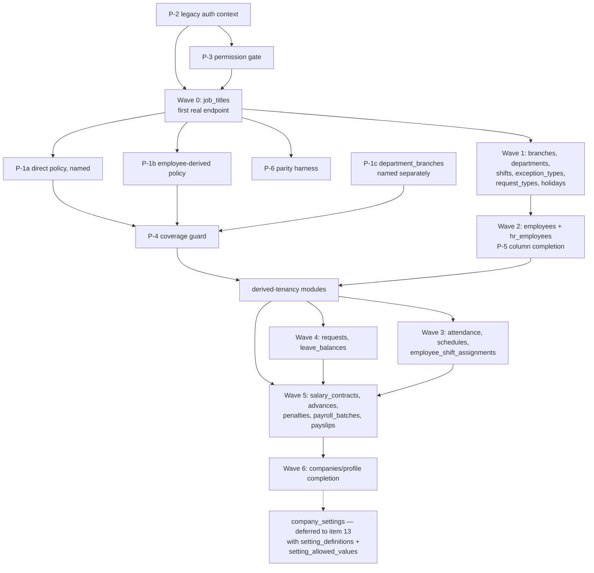

# Item 12 — Specification: Remap Built Java Functionality onto the Legacy MariaDB Contract

## Status

**Specification ready for approval. D-1 through D-6 were all settled by the
repository owner on 2026-08-18.**

**Amended 2026-08-18 by D-045 and D-046**, after discovery for Wave 12.1
disproved two of this document's own assumptions — see §2.1. The build order,
PR boundaries and every settled decision below are otherwise unchanged.

**Amended 2026-08-18 by D-047 (settles D-7, §12.1) and D-048 (amends PR 12.1's
scope description, §8)**, both raised by Wave 12.1 discovery itself. Neither
changes the build order or any other settled decision.

**D-047 further amended 2026-08-18: D-050 found it not achievable without a
schema change; D-051 finally settles D-7 as option (a), global uniqueness.**
See §12.1.

**Specification approved and both §12.1 gates clear. PR 12.1 implementation
is underway** per the repository owner's direction, this conversation,
2026-08-18, under the implementation-assignment exception recorded in
[`CLAUDE.md`](../../CLAUDE.md).

**Wave 12.1 and Wave 12.2 (PR 12.2, the P-1a/P-1b/P-1c/P-4 tenancy mechanism)
are both complete** — see D-052 and D-053.

**Amended 2026-08-18 by D-054, D-055, D-056, D-057**, after a discovery/spec
pass (research only, no code) over the org-master dependency cluster
(`branches`, `departments`, `department_branches`, `job_titles`) found §7's
Wave 1 and §8's PR 12.3/12.4 rows stale and internally inconsistent — see §7,
§8 (now corrected) and the decision log. Wave 12.3 is
`branches → departments`+`department_branches` → `job_titles`, as three
sequential PRs (12.3a/12.3b/12.3c) — an engineering split only; the
production Phase 1 cutover remains one complete replacement (D-040).
Implementation of 12.3a (`branches`) begins once this amendment and the
governing-evidence-precedence addition to ADR-0011 (below) are recorded.

This is a planning artifact, per this repository's [`CLAUDE.md`](../../CLAUDE.md)
boundary. It specifies punch-list item 12
([`2026-08-17-phase1-punch-list.md`](2026-08-17-phase1-punch-list.md)) and
answers ADR-0011's open question — "whether Phase 1 delivers all 38 modules in
one release or several internal milestones... the engineering sequence within
it is not yet fixed."

## Scope boundary

This document proposes an **engineering sequence only**. It does not change the
production migration strategy: Phase 1 still cuts over the complete Java backend
as one replacement against the same MariaDB database (ADR-0011, D-040).

Explicitly out of scope, and untouched below:

- redesigning the Phase 2 target schema;
- resuming PostgreSQL/ETL work (frozen in `phase2Test` per D-040);
- introducing ADR-0010's Phase 3 canonical-permission model (Phase 1 stays on
  D-044's raw `hr_permissions` column port);
- item 13 (the 19 legacy modules with no Java counterpart at all).

## Method

Discovery was run against `hr-platform` @ `a2e8143` (current `main`) and the
`hr-legacy` working copy, comparing the 31 PostgreSQL JPA entities against the
vendored legacy contract at
`backend/src/test/resources/legacy/mysql_workin.schema.sql` — the same file
`scripts/check_legacy_schema_drift.py` proves byte-identical to `hr-legacy`.
Every count below is measured, not estimated.

---

## 1. Scope inventory

### 1.1 The shared-table set

ADR-0011 recorded "20 shared names". That count is by **exact table name**, and
it undercounts by one: Java's `leave_balances` and legacy's `leave_balance` are
the same concept split by pluralisation. The real Item 12 surface is **21
tables**.

Tenancy column below is the single most important axis — see finding F-1.

| # | Java entity | Package | Legacy table | Legacy tenancy | Java/legacy cols | Legacy module (endpoints) |
|---|---|---|---|---|---|---|
| 1 | `Company` | `identity` | `companies` | **tenant root** | 4 / 21 | `company` (3) |
| 2 | `Employee` | `employees` | `employees` | direct `company_id` | 11 / 27 | `employees` (14), `hr_employees` (3) |
| 3 | `Branch` | `organization` | `branches` | direct `company_id` | 10 / 11 | `branches` (6) |
| 4 | `Department` | `organization` | `departments` | direct `company_id` | 5 / 6 | `departments` (5) |
| 5 | `JobTitle` | `organization` | `job_titles` | direct `company_id` | 6 / 7 | `job_titles` (5) |
| 6 | `Shift` | `organization` | `shifts` | direct `company_id` | 7 / 8 | `shifts` (5) |
| 7 | `ExceptionType` | `attendance` | `exception_types` | direct `company_id` | 3 / 6 | `attendance_exception_types` (5) |
| 8 | `RequestType` | `requests` | `request_types` | direct `company_id` | 8 / 9 | `request_types` (5) |
| 9 | `OfficialHoliday` | `holidays` | `company_official_holidays` | direct `company_id` | 5 / 5 | `company_official_holidays` (5) |
| 10 | `PayrollBatch` | `payroll` | `payroll_batches` | direct `company_id` | 7 / 8 | `payroll_batches` (10) |
| 11 | `CompanySettings` | `companysettings` | `company_settings` | direct `company_id` | 8 / 4 (EAV) | `company_settings` (6) — **deferred to item 13 (D-4)** |
| 12 | `DepartmentBranch` | `organization` | `department_branches` | **derived** via `department_id` | 4 / 2 | (within `departments`) |
| 13 | `Attendance` | `attendance` | `attendance` | **derived** via `employee_id` | 9 / 10 | `attendance` (15) |
| 14 | `EmployeeSchedule` | `schedule` | `employee_schedules` | **derived** via `employee_id` | 8 / 8 | `schedules` (3) |
| 15 | `EmployeeShiftAssignment` | `schedule` | `employee_shift_assignments` | **derived** via `employee_id` | 5 / 5 | (within `schedules`) |
| 16 | `LeaveRequest` | `requests` | `requests` | **derived** via `employee_id` | 13 / 14 | `requests` (7) |
| 17 | `LeaveBalance` | `requests` | `leave_balance` | **derived** via `employee_id` | 10 / 9 | `leave_balances` (10) |
| 18 | `Advance` | `advances` | `advances` | **derived** via `employee_id` | 9 / 17 | `advances` (8) |
| 19 | `Penalty` | `penalties` | `penalties` | **derived** via `employee_id` | 8 / 8 | `penalties` (7) |
| 20 | `SalaryContract` | `payroll` | `salary_contracts` | **derived** via `employee_id` | 17 / 18 | `salary_contracts` (5) |
| 21 | `Payslip` | `payroll` | `payslips` | **derived** via `employee_id` | 26 / 25 | `payslips` (6) |

**Totals**: 10 tables carry `company_id` directly, 1 is the tenant root, and
**10 do not carry it at all**. The 19 legacy modules these tables serve hold
**128 of the 200 legacy endpoint files**.

Row 11 (`company_settings`, 6 endpoints) is listed for completeness of the
shared-table analysis but is **out of Item 12's delivery scope** per D-4. Item
12 therefore delivers 20 tables and 122 endpoint files.

### 1.2 What Item 12 can build on

Already merged and proven against real MariaDB (items 1–11, PR #100/#101):

- `LegacyEmployee` / `LegacyEmployeeRepository`, `LegacyCompany` /
  `LegacyCompanyRepository` — the adapter pattern to copy.
- `LegacyValues` — `tinyint(1)` booleans, `'0000-00-00'` zero dates, and enum
  spelling conversion. Already solves most representation hazards below.
- `TenantScope`, `TenantFilter`, `TenantFilterActivator`,
  `TenantAwareJpaTransactionManager`, `NO_TENANT` sentinel.
- `LegacyTenantContextService` (trust-boundary re-derivation),
  `LegacyRefreshTokenService`, `LegacyLoginController`.
- `LegacyHrPermissionEnforcer` + `LegacyHrPermissions` (D-044 raw-column port).
- `phase1-mysql` profile, `PostgresPersistenceConfig` /
  `LegacyPersistenceConfig`, and `ProfileCoverageArchTest`.

---

## 2. Findings that change the shape of the work

These are measured facts, not hypotheses. Each is reproducible from the
vendored schema and the Java sources.

### 2.1 — Two of this specification's own assumptions were disproven

Recorded here rather than silently edited away, because both were written into
the acceptance proof and both were caught by the §10 execution rule working as
intended — before any code was written.

**A. `can_job_titles` does not gate anything (D-045).** §9 originally specified
`LegacyHrPermissionEnforcer` requiring `can_job_titles` as a step in the Wave
12.1 evidence chain. Legacy never enforces that flag. Enforcement lives in
helper wrappers (`require_company_settings_access` → `require_hr_permission`),
called at **22 sites across 8 modules**, and only **two of the seventeen
`can_*` flags are ever enforced**: `can_company_settings` and `can_employees`.
The other fifteen — `can_job_titles` among them — are client-facing UI data for
the desktop menu. Implementing the gate as specified would have **added**
authorization legacy does not have, rejecting users legacy admits.

D-044 had already required exactly this check ("each one's enforcement... must
be checked against what legacy's own equivalent endpoint actually does... so
parity isn't assumed"); this specification failed to apply its own governing
decision. D-045 promotes that Follow-up to a binding per-endpoint checklist
item.

**B. The real guard stack is three checks larger, and Phase 1 has none of
them (D-045).** Every legacy endpoint runs `requireAuth()`, which enforces JWT
presence, then `token_version` against `employees.token_version` (single active
session, 401 `SESSION_REPLACED`), then role membership (403
`FORBIDDEN_INSUFFICIENT_ROLE`) — followed by `requireCompanyActive()` (403
`COMPANY_ACCOUNT_NOT_ACTIVE`). Phase 1's JWT carries `membership_id`/`tenant_id`
with **no role claim and no `token_version` enforcement**. Claiming endpoint
parity without these would weaken authorization in the opposite direction:
admitting requests legacy rejects. They become prerequisites P-7, P-8 and P-9.

**C. `job_titles` is not an isolated module (D-046).** Four of its five
endpoints carry three joins each, returning `department_name` and a
`branches_summary` `GROUP_CONCAT` over `department_branches` → `branches`. It
cannot reach parity without `departments`, `branches` and `department_branches`
— the last needing P-1c, scheduled for Wave 2. Wave 12.1's module is therefore
**`attendance_exception_types`**, which is single-table for list/one/create/
update, carries a direct `company_id`, and still exercises an ungated read path,
a genuinely gated write path (`can_company_settings`), role-conditional
visibility, search and pagination.

### F-1 — The single-condition tenant filter does not generalise (blocking)

`TenantFilter`'s javadoc states:

> Legacy names this column `company_id` on every tenant-owned table, so one
> condition covers all of them. That uniformity is a property of the legacy
> schema being adopted unchanged... and it is what makes a single filter viable
> at all.

**This is true only for the three tables built so far.** Verified against the
vendored schema, these 10 Item 12 tables contain no `company_id` column at all:

`advances`, `attendance`, `department_branches`, `employee_schedules`,
`employee_shift_assignments`, `leave_balance`, `payslips`, `penalties`,
`requests`, `salary_contracts`.

`TenantFilter.CONDITION` (`company_id = :companyId`) cannot be applied to any of
them — Hibernate would emit SQL referencing a non-existent column. Since
`TenantFilterCoverageTest` fails the build when a tenant-owned entity is
unfiltered, **the first derived-tenancy entity added will fail the build until a
second mechanism exists**. This is the gating prerequisite for 10 of 21 tables.

The good news: the derivation is near-uniform. Nine of the ten reach tenant
identity by the same one-hop path, `employee_id → employees.company_id`. Only
`department_branches` differs (`department_id → departments.company_id`).

### F-2 — No existing business controller or service runs under `phase1-mysql`

`BackendApplication` scans `NoScanMarker` (an empty root), so component scanning
is entirely delegated to the two persistence configs. `LegacyPersistenceConfig`
scans:

`com.workin.legacy`, plus `backend.identity`, `backend.security`,
`backend.tenancy`, `backend.config`, `backend.authorization`, `backend.i18n`.

The **13 domain packages are absent from that list**. Under `phase1-mysql`,
none of the 24 `/api/tenant/**` controllers or their services are loaded at all.
They are not "surviving behind an adapter" today — they do not exist in the
context. Only 16 classes carry `@Profile("!phase1-mysql")`, all in the six
scanned infra packages.

This means the phrasing "remap the remaining built modules" needs a decision it
does not currently contain: whether Item 12 **ports** logic into
`com.workin.legacy` (as items 9–11 did) or **generalises** the existing domain
services to run under both profiles. See D-1 in §12.

### F-3 — Domain services couple to two Postgres-only mechanisms

Every one of the 11 domain packages imports `AuthorizationContext`; 9 of 11 also
use `TenantSessionVariable`:

| Package | Files | Uses `AuthorizationContext` | Uses `TenantSessionVariable` | Membership-coupled files |
|---|---|---|---|---|
| `advances` | 8 | 2 | 1 | 0 |
| `attendance` | 21 | 5 | 3 | 0 |
| `companysettings` | 7 | 2 | 1 | 0 |
| `employees` | 8 | 2 | 1 | 0 |
| `holidays` | 7 | 2 | 1 | 0 |
| `members` | 16 | 3 | 1 | 7 |
| `organization` | 27 | 5 | 4 | 0 |
| `payroll` | 25 | 7 | 3 | 0 |
| `penalties` | 7 | 2 | 1 | 0 |
| `requests` | 23 | 6 | 3 | 1 |
| `schedule` | 15 | 2 | 1 | 0 |

- `TenantSessionVariable` issues `SELECT set_config('app.current_company_id', …)`
  — PostgreSQL-only, meaningless on MariaDB. Phase 1's equivalent is
  `TenantScope` + the Hibernate filter, already built.
- `AuthorizationContext` is the record `(identityId, membershipId, companyId, …)`
  with `hasPermission(String permissionKey)` — the ADR-0010 membership model,
  backed by `identities`, `tenant_memberships`, `membership_roles`,
  `membership_resource_scopes`. **None of those four tables exist in legacy.**
  Phase 1's authenticated principal is an `employee_id`, and its permission
  check is `hr_permissions`' 17 boolean columns (D-044).

So no domain service survives *literally* unchanged: each needs its context
parameter and permission check swapped, independent of persistence.

### F-4 — `company_settings` is incompatible in both directions

Already recorded in ADR-0011 and re-confirmed: Java's `company_settings` is one
row per company with six typed columns (`month_start_day`, `month_end_day`,
`weekly_off_days`, `overtime_rate`, `pay_overtime`, `monthly_leave_accrual`);
legacy's is an EAV join to `company_setting_values` keyed by
`setting_definition_id`. This is a genuine rewrite, not a remap, and it drags in
two legacy-only tables (`setting_definitions`, `setting_allowed_values`) that
are formally item 13 scope. **Resolved by D-4**: `company_settings` is removed
from Item 12 and lands in item 13 with those two tables, rather than leaking
item 13 schema into item 12.

### F-5 — The two hub tables have the largest column gaps

`companies` (4 Java cols vs 21 legacy) and `employees` (11 vs 27) are not
partial mappings by accident — legacy carries the authentication and onboarding
surface there (`password_hash`, `status`, `otp_verified`, `profile_completed`,
`token_version`, `join_request_status`, `employee_code`, `national_id`,
`hire_date`, `birth_date`, `gender`). Any endpoint returning a full legacy
employee or company payload needs columns the current adapter does not map.

### F-6 — Two legacy columns are database-generated

`leave_balance.remaining_days` (`GENERATED ALWAYS AS (total_days - used_days)
STORED`) and `salary_contracts.total`. Both must map read-only
(`insertable = false, updatable = false`). `LeaveBalance` already does this for
`remaining_days`; `SalaryContract` currently has **no** `total` column mapped at
all, and the Java `total` is absent from the entity — a write to it would fail.

### F-7 — A referential cycle exists between `departments` and `employees`

`departments.manager_id → employees.id` while `employees.department_id →
departments.id`. Benign for read adapters, but it means neither can be declared
"complete" before the other, and any eager `@ManyToOne` mapping across that pair
will need `FetchType.LAZY` or id-only mapping.

---

## 3. Representation differences to handle

Mostly already solved by `LegacyValues`; listed so no boundary re-discovers them.

| Class of difference | Where it occurs | Handling |
|---|---|---|
| `tinyint(1)` booleans | `job_titles.is_active`, `employees.is_active`, `employees.can_check_in_any_branch`, `employees.is_mobile_attendance_enabled`, `exception_types.is_active`, `penalties.applied_to_payroll` | `LegacyValues.toBoolean` / `fromBoolean` |
| `'0000-00-00'` zero dates | legacy date/datetime columns; 24 known defective rows (`hr-legacy#28/#29`) | Map column as `String`, convert via `LegacyValues.toDate`; **cannot** be handled at the JPA layer — the JDBC driver raises before conversion |
| MySQL `enum(...)`, lowercase | `advances.status`, `requests.status` (`pending`/`approved`/`rejected`), `payroll_batches.status` (`draft`/`finalized`), `salary_contracts.salary_mode` (`monthly`/`daily`) | `LegacyValues.toEnum` / `fromEnum`; do **not** use `@Enumerated(STRING)` against the legacy spelling |
| Generated columns | `leave_balance.remaining_days`, `salary_contracts.total` | read-only mapping (F-6) |
| Audit columns absent in Java | `created_at` / `updated_at` on 12 of 21 legacy tables | **D-3**: mirror the MariaDB contract as it exists. Map read-only where legacy maintains the column; **never synthesize a timestamp**, and never migrate the MariaDB schema to add one. Derive a timestamp only where documented legacy API behaviour requires it *and* that behaviour is evidence-backed |
| Java-only `company_id` | 9 entities carry a `company_id` the legacy table lacks | Dropped from the legacy entity; tenancy comes from the derived filter (F-1) |
| Naming | `leave_balances` vs `leave_balance`; `approver_membership_id` vs `approver_id` | Explicit `@Table` / `@Column` names |
| Unsigned integer keys | all legacy PKs are `int(10) UNSIGNED` | `Long` in Java (already the convention); negative `NO_TENANT` sentinel stays safe |
| EAV | `company_settings` | rewrite (F-4) |

---

## 4. What survives, and what needs real rework

| Layer | Verdict |
|---|---|
| DTOs / request-response records | **Mostly survive.** They are plain records with no persistence or authorization coupling. But legacy contract parity is judged against the PHP response shape, not the current DTO — each needs diffing against its legacy endpoint. |
| Validation annotations, i18n, error mapping (`ApiExceptionHandler`) | **Survive.** `backend.i18n` is already in the `phase1-mysql` scan list. |
| Pure calculation logic (payroll totals, attendance derivation, schedule expansion) | **Survives** — the highest-value reuse in Item 12, and the reason a port is not a rewrite. |
| Domain services (`AdvanceService`, `AttendanceService`, …) | **Need mechanical rework**: `AuthorizationContext` → legacy employee context; `TenantSessionVariable` → removed; concrete `…Repository` → legacy repository. Logic body largely intact. |
| Controllers | **Need rework**: route (`/api/tenant/**` → `/api/legacy/**`), context resolution, permission gate (`hasPermission(key)` → `can_*` flag). |
| `members` package (16 files, 7 membership-coupled) | **Formally excluded from Item 12 (D-5).** `tenant_memberships` / `membership_roles` / `membership_resource_scopes` do not exist in legacy. The package belongs to the redesigned identity/membership/tenant-switching architecture and **stays frozen**. Where legacy PHP exposes equivalent business functionality needed for the full replacement, item 13 implements it under its **actual legacy module and contract** — never by adapting the new membership model. |
| `identity` (`Identity`, `RefreshToken`) | **Already replaced** by `LegacyEmployee` + `legacy_refresh_tokens` (item 9). |
| `platformadmin` | **Out of scope** — no legacy equivalent, and it is not tenant-facing. |
| `companysettings` | **Deferred to item 13** (D-4). |

### 4.1 The reuse constraint attached to D-1

D-1 selects the `com.workin.legacy` port, but with an explicit limit recorded by
the owner on 2026-08-18:

> Phase 1 controllers, application orchestration, persistence, and security
> wiring may be legacy-specific. Proven business logic must **not** be
> duplicated. Where logic is genuinely storage-independent and parity-proven,
> extract or reuse it as pure shared logic rather than maintaining two
> implementations.

Operationally, for every module PR:

- **Legacy-specific, duplicated deliberately**: controller, route, DTO
  assembly to the legacy payload shape, repository/entity, permission gate,
  tenancy policy selection.
- **Extracted and shared, never re-implemented**: calculation and rule logic
  that takes values in and returns values out — payroll arithmetic, attendance
  derivation, schedule expansion, leave accrual. These move to a pure,
  dependency-free class both profiles call.
- **The test that keeps this honest**: extracted logic keeps its existing
  PostgreSQL-profile unit tests *and* gains legacy parity tests. If a rule needs
  a second implementation to satisfy legacy, that is evidence of a behavioural
  difference (U-2) and must be recorded, not forked silently.

---

## 5. Shared prerequisites

These are the multi-consumer building blocks. Each unlocks many tables, and
each is why a table-by-table order would be wrong.

| ID | Prerequisite | Unlocks | Why shared |
|---|---|---|---|
| **P-1a** | **Direct tenancy policy** — today's `company_id = :companyId` condition, renamed and documented as *one* named policy rather than "the" filter. **Built (PR 12.2): `TenantFilter`, javadoc corrected (U-1), condition unchanged.** | 10 of 21 tables | F-1. Making it explicitly one policy among several is what stops the next table being forced through it. |
| **P-1b** | **Employee-derived tenancy policy** — a **separate** `@FilterDef` scoping via `employee_id IN (SELECT id FROM employees WHERE company_id = :companyId)`. **Built (PR 12.2): `EmployeeDerivedTenantFilter`, condition `employee_id IN (SELECT e.id FROM employees e WHERE e.company_id = :companyId)` — the inner table is aliased, discovered necessary the hard way (a real `SQLGrammarException` against Hibernate's filter-condition templating, see D-053's Evidence).** | 9 of 21 tables | F-1. Nine tables share this exact one-hop path. Owner decisions 2026-08-18: a distinct policy, not a parameterisation of P-1a (D-1 line), and enforced **centrally by the filter** rather than by tenant joins duplicated across repository methods (D-2), preserving ADR-0012's one-enforcement-point model. |
| **P-1c** | **`department_branches` — the remaining case, named and handled on its own**. **Built (PR 12.2): `DepartmentBranchesTenantFilter`, condition `department_id IN (SELECT d.id FROM departments d WHERE d.company_id = :companyId)`, same aliasing requirement as P-1b.** | 1 table | Reaches tenancy via `department_id → departments.company_id`, not `employee_id`. Owner decision 2026-08-18: identify it separately; do **not** force it through a generic filter. |
| **P-2** | **Legacy authorization context** — a per-request record carrying `employeeId` + `companyId`, resolved from the authenticated legacy JWT, replacing `AuthorizationContext` | every module | F-3. Partially exists inside `LegacyTenantContextService`; needs promoting to a reusable request-scoped component. |
| **P-3** | **Permission gate helper** — a uniform way for a legacy controller to require a `can_*` flag | every module | `LegacyHrPermissionEnforcer` exists; needs a call-site convention (D-044 forbids an annotation/interceptor shape). |
| **P-4** | **Coverage guard extension** — `TenantFilterCoverageTest` must require every tenant-owned entity to declare *exactly one* named policy (P-1a/P-1b/P-1c) and still fail closed. **Built (PR 12.2): tenant-ownership is now decided by parsing the vendored schema's real columns, not by what the Java mapping declares — closing the exact blind spot F-1 named, and catching a real, already-shipped gap (`LegacyHrPermissions`, unfiltered since Wave 12.1) in the process. See D-053.** | every module | Otherwise the guard silently accepts an unfiltered derived-tenancy entity, or one carrying a policy that does not match its columns. |
| **P-5** | **Employee/company column completion** — extend `LegacyEmployee` / `LegacyCompany` to the columns endpoints actually return | most modules | F-5. |
| **P-6** | **Parity harness** — a reusable way to assert a Java response equals the legacy PHP endpoint's shape | every module | Otherwise "contract parity" is asserted per-PR by eye. |
| **P-7** | **`token_version` session-replacement validation** — the authenticated employee's token claim must equal `employees.token_version`, else 401 `SESSION_REPLACED` | every authenticated endpoint | D-045. Legacy's single-active-session guarantee. Phase 1 maps the column but never checks it, so every legacy endpoint would admit a replaced session. |
| **P-8** | **Legacy role authorization** — a role claim on the legacy JWT and a per-endpoint allowed-roles check, else 403 `FORBIDDEN_INSUFFICIENT_ROLE` | every endpoint with a role list | D-045. Phase 1's JWT carries no role claim at all. |
| **P-9** | **Active-company validation** — `companies.status = ACTIVE`, else 403 `COMPANY_ACCOUNT_NOT_ACTIVE` | every authenticated endpoint | D-045. Applied by `requireCompanyActive()` on every endpoint examined. |

---

## 6. Dependency graph

Hard ordering constraints, from real foreign keys:

- `employee_shift_assignments.shift_id → shifts`; `attendance.exception_type_id
  → exception_types`; `requests.request_type_id → request_types`;
  `job_titles.department_id → departments`; `department_branches → departments +
  branches`. **Org masters precede their consumers.**
- `payslips.batch_id → payroll_batches`, and payslip figures aggregate
  `salary_contracts`, `advances`, `penalties`, and attendance-derived days.
  **Payslips are last in the payroll cluster.**
- Request approval mutates `leave_balance.used_days`. **`requests` and
  `leave_balances` land together or in that order.**
- `departments.manager_id ↔ employees.department_id` is a cycle (F-7) — map ids
  only, no eager association.

---

## 7. Recommended build order

Ranked against the owner's five criteria: shared dependencies first, then
unlocked downstream work, then risk, then reuse of the proven pattern, then
provability on real MariaDB.

| Wave | Content | Rationale |
|---|---|---|
| **0** | `attendance_exception_types` end-to-end + P-2, P-3, P-6, **P-7, P-8, P-9** | **Amended by D-046** (was `job_titles`, which needs three joins into Wave 1/2 tables — §2.1C). Single-table for list/one/create/update with a direct `company_id`, so it needs no new tenancy mechanism, yet still exercises an ungated read path, a gated write path whose legacy counterpart genuinely requires `can_company_settings`, role-conditional visibility, search and pagination. Carries the three new request guards because every later module needs them. Closes the PR #101 evidence gap (§9) at the earliest possible point and fixes the module template before it is copied 18 times. |
| **1** | **Corrected by D-054, 2026-08-18.** `branches` → `departments` (with `department_branches` — not a separate table in this wave, see below) → `job_titles`, in that dependency order. `shifts`, `request_types`, `company_official_holidays` **move out of this wave** to their own (number not yet assigned) — they don't block `job_titles` and bundling them here was never load-bearing. 16 real endpoints across the three modules (`department_branches` has none of its own). | **This row previously omitted `department_branches` even though it cited D-046 finding C as the reason `job_titles` was rescheduled here — and finding C names `department_branches` as one of `job_titles`' three required joins.** Wave 12.3 discovery (this conversation, 2026-08-18) confirmed by reading `departments/{create,update}.php` in full: `department_branches` is mutated entirely inside `departments`' own transaction and has no endpoint files of its own, so it cannot be "Wave 2's P-1c table" separately from `departments` — `departments`' own read queries `INNER JOIN` through it, so `departments` cannot reach read parity without it in the same unit of work. `job_titles`' `branches_summary` needs real `department_branches` rows to prove its `GROUP_CONCAT` shape. P-1c itself (the mechanism) is unaffected — already built in Wave 12.2 (D-053) — this correction is about which *wave* the `department_branches` *table* ships in, not the tenancy policy. |
| **2** | **P-1a + P-1b + P-1c + P-4** (built, Wave 12.2/D-053), then `employees` + `hr_employees` with P-5 | `department_branches` **removed from this row by D-054** — it ships with `departments` in Wave 1/12.3b, not here (the row's endpoint count is unaffected, since `department_branches` never had endpoint files of its own to count). The tenancy policies gate everything after; landing them with `employees` is deliberate — `employees` is the join target of P-1b, so the mechanism and its join target are proven together. 17 endpoints. |
| **3** | `attendance` (+`exception_types` consumers), `employee_schedules`, `employee_shift_assignments` | First derived-tenancy consumers. `attendance` is the largest single module (15 endpoints) and the richest calculation logic to reuse. |
| **4** | `requests`, `leave_balances` | Coupled by the approval side effect on `used_days`. 17 endpoints. `approver_id` vs `approver_membership_id` is resolved here. |
| **5** | `salary_contracts` → `advances` → `penalties` → `payroll_batches` → `payslips` | Strict FK/aggregation order. Highest business risk (money), so it goes after the pattern is proven six times. `salary_contracts.total` (F-6) and `advances`' 9 unmapped `deduction_*` columns are resolved here. 36 endpoints. |
| **6** | `companies` / `profile` column completion | The last hub-table gap (F-5). Isolated at the end so it never blocks the mechanical waves. **`company_settings` is no longer here** — D-4 moved it to item 13. |

Rationale against criterion 2 (downstream unlock): Wave 0+1 unlock every later
wave's FK targets; Wave 2's P-1 unlocks 10 tables at once. Against criterion 3
(risk): payroll is deliberately last; against criterion 5, every wave is
provable against real MariaDB because each ends in HTTP-level tests.

---

## 8. Proposed branch and PR boundaries

One PR per row. Each is independently reviewable, independently revertible, and
ends green on CI.

| PR | Branch | Contents | Tests that must pass before merge |
|---|---|---|---|
| 12.1 | `phase1/item12-attendance-exception-types` | P-2, P-3, P-6, **P-7, P-8, P-9**, `LegacyExceptionType` + repository + service + controller under `/api/legacy/attendance_exception_types/**`; re-points the isolation proofs and deletes `LegacyIsolationProbeController`. **Module-focused, not single-table (D-048)**: delete additionally issues native, company-scoped FK-clearing `UPDATE`s against `attendance` and `request_types` ahead of the hard delete, atomically, with no new adapters for either table | Real-MariaDB adapter test; **full-path E2E** per §9; each guard proven independently — replaced session (401), insufficient role (403), inactive company (403), missing `can_company_settings` on a write (403); cross-tenant denial; `phase1-mysql` off ⇒ default profile unaffected; **D-051 (final; supersedes D-047/D-050)**: a duplicate name 409s regardless of which company already used it — global uniqueness, matching legacy's actual behaviour and the schema's real `unique_exception_type_name` constraint, accepted by the repository owner rather than pursued via a schema migration; **D-048**: database-state test on `attendance`/`request_types` post-delete, a rollback test proving no partial FK-clear persists on failure, and a cross-tenant test proving another company's `attendance`/`request_types` rows are unmodified by a delete under this company's context; **§10.1 applied strictly to all five legacy endpoints** before 12.1 is called complete |
| 12.2 | `phase1/item12-tenancy-policies` | **Standalone security-mechanism PR** (owner-accepted 2026-08-18). P-1a, P-1b, P-1c and P-4 only — no modules. Corrects `TenantFilter`'s disproven javadoc claim (U-1). **Implemented (see D-053).** `EmployeeDerivedTenantFilter`/`DepartmentBranchesTenantFilter` (new, sibling classes to `TenantFilter`); `TenantFilterBinder`/`TenantFilterActivator` extended to bind/activate/deactivate all three together; `TenantFilterCoverageTest` redesigned to classify tenant-ownership from the vendored schema's real columns rather than the Java mapping — which caught and fixed a real, already-shipped gap (`LegacyHrPermissions`, unfiltered since Wave 12.1, now carries P-1b). Three test-scoped probe entities (`AttendanceProbeRow`, `PayslipProbeRow`, `DepartmentBranchProbeRow`) prove the mechanism against real tables without starting any business module | Each policy returns zero rows unscoped (fail-closed) — asserted per policy, not once (`DerivedTenancyPoliciesFailClosedTest`, 14 tests); coverage guard fails the build when a tenant-owned entity declares no policy **or the wrong one for its columns**, verified against the mistake as `TenantFilterCoverageTest` was; forged/wrong-tenant isolation proven for one P-1b table (`attendance`) and for `department_branches`, against real cross-tenant data; **index and query-plan verification (D-2) — a true merge gate, cleared with real evidence.** `EXPLAIN` evidence on the high-volume derived paths (`attendance`, `payslips`) at realistic volume (30 companies, 3,000 employees, 60,000/30,000 rows) shows MariaDB semi-joining through `employees`' indexed `company_id` and reaching each derived table via its own `employee_id` index — no full table scan in either plan (`TenantFilterQueryPlanTest`, real output recorded in D-053). No index needed adding; a query-shape fix was: the first filter-condition draft failed with a real `SQLGrammarException` against Hibernate's alias-templating and was corrected inside this PR before any test asserted success. Full suite: 410 tests, 0 failures, both profiles |
| 12.3a | `phase1/item12-branches` | **Implemented — see D-060.** `branches`: `LegacyBranch` + repository + service + controller (`com.workin.legacy.organization`), all 6 endpoints (`list`, `one`, `create`, `update`, `delete`, `generate_qr`), P-1a; the location-coordinate heuristic ported literally as `LegacyBranchLocationResolver` (D-058: PHP is the specification for this logic, not an idealised redesign) | Per-module adapter + E2E parity vs legacy (37 tests: 28 E2E, 9 tenancy/adapter), verified against real production data first (D-059) — `radius_meters = 0`, both-null lat/lng, `is_active = 0` all round-trip; **D-056**: delete reproduces legacy's explicit `branch_assigned_employees_count()` pre-check (409 before attempting the delete, proven not to short-circuit-after-attempting), atomic `department_branches` cleanup + hard delete, FK-violation catch retained only as a documented race-condition fallback; **D-057**: explicit test proving a principal with no `hr_permissions` row at all succeeds on every write, and that the role gate (unlike Wave 12.1) applies to reads too; **D-060 explicitly approves a uniform 404 security divergence for branch update**: both a missing ID and another tenant's ID return `branch_not_found`; neither the legacy missing-ID 500 nor the cross-tenant 200 disclosure is reproduced |
| 12.3b | `phase1/item12-departments` | **Implemented and corrected after owner review — see D-061/D-068/D-070.** `departments` and `department_branches` remain one aggregate boundary. All 5 endpoints; P-1a on `departments`; P-1c on real `department_branches`; row-plus-links create and full branch-set replacement are transactional. Test application connections use production-equivalent non-strict MariaDB semantics; numeric casts, explicit PHP string casts, PHP `empty(...)`, and associative-array value iteration are centralized in `LegacyValues`; raw query name normalization plus scalar/append/keyed shape is preserved in `LegacyQueryParameters`; mutation responses refresh MariaDB-persisted values | Independently runnable coverage: `LegacyValuesTest` (19 tests), `LegacyQueryParametersTest` (8 tests), `LegacyDepartmentEndToEndTest` (30 real-MariaDB HTTP tests), and `LegacyDepartmentTenancyTest` (6 adapter/tenancy tests), with no dependency on 12.3c types. Coverage proves join asymmetries, PHP scalar and array cast paths, normalized external parameter names, keyed arrays, ordered duplicate/mixed scalar/append/keyed query parsing before Spring conversion, and D-070's narrow server-level 400 divergence for invalid percent encoding; integer-bound saturation, object-shaped manager/branch inputs, MariaDB normalization, exact post-delete failure response plus full rollback, the branchless update's legacy 500-after-commit response quirk, D-055, D-057's absent permission gate, and cross-tenant denial. Production read-only evidence: 1,350 junction links, zero missing departments, zero missing branches, and zero cross-company links; no production mutation |
| 12.3c | `phase1/item12-job-titles` | `job_titles`, gated on 12.3a and 12.3b being feature-complete (not merely started) — its read contract needs real `branches`/`departments`/`department_branches` rows. All 5 endpoints, P-1a | Per-module adapter + E2E parity incl. the `LEFT JOIN departments` + correlated `GROUP_CONCAT` over `department_branches → branches` (`branches_summary`); `department_id` required by the PHP layer on create despite the column being schema-nullable, and never clearable back to `NULL` via update; `department_belongs_to_company()`'s active-department-only gate on create/update; delete is **soft** (`is_active = 0`, no guard needed — the FK is `ON DELETE SET NULL`) — do not reuse the existing PostgreSQL `JobTitleService`'s hard-delete shape; **D-057**: no `hr_permissions` gate |
| 12.4 | `phase1/item12-employees` | P-5 + `employees`, `hr_employees` (`department_branches` **removed from this row by D-054** — it shipped with `departments` in 12.3b) | Column-completion parity vs legacy payload; zero-date rows readable; P-1b proven through its join target |
| 12.5 | `phase1/item12-attendance-schedules` | `attendance`, `employee_schedules`, `employee_shift_assignments` | Calculation-parity tests vs legacy; derived tenancy on three tables; timezone handling unchanged |
| 12.6 | `phase1/item12-requests-leave-balances` | `requests`, `leave_balances` | Approval side effect on `used_days`; generated `remaining_days` read-only; `approver_id` mapping |
| 12.7 | `phase1/item12-payroll-contracts-advances-penalties` | `salary_contracts`, `advances`, `penalties` | `total` generated-column read-only; `deduction_*` columns mapped; money arithmetic parity |
| 12.8 | `phase1/item12-payroll-batches-payslips` | `payroll_batches`, `payslips` | End-to-end payroll run parity against a seeded legacy fixture; aggregation across four upstream tables |
| 12.9 | `phase1/item12-companies-profile` | `companies` / `profile` column completion (F-5) | Legacy company payload parity; onboarding/status columns readable; tenant-root behaviour unchanged |

PR 12.2 is deliberately mechanism-only, and the owner accepted it as a
standalone security PR on 2026-08-18: it is the one change that can silently
weaken tenant isolation across ten tables, and it must be reviewable without
module noise around it.

`company_settings` has **no PR in this list** — D-4 moved it to item 13, where
it lands together with `setting_definitions` and `setting_allowed_values` rather
than leaking item 13 schema into item 12.

---

## 9. Closing the PR #101 evidence gap, in PR 12.1

The gap, as items 9/10/11 recorded it: every isolation and permission proof so
far terminates at a **test-only probe controller**
(`LegacyIsolationProbeController`, in `src/test`), because no real legacy
business endpoint exists. Nothing yet proves the composed path end to end.

`attendance_exception_types` closes it (D-046): single-table, direct
`company_id`, and a write path whose legacy counterpart genuinely enforces
`can_company_settings` (D-045).

The proof obligation for PR 12.1 — real HTTP, real MariaDB, `phase1-mysql`
active, **no probe controller anywhere in the path**:

1. `POST /api/legacy/auth/login_employee` with seeded legacy credentials →
   a real JWT carrying the employee's role and `token_version`.
2. That JWT on `GET /api/legacy/attendance_exception_types` →
   `legacySecurityFilterChain` authenticates it.
3. **P-7** — the token's `token_version` matches `employees.token_version`.
4. **P-8** — the role satisfies the endpoint's allowed-roles list (for list/one
   legacy allows any authenticated employee; for create/update/delete,
   `COMPANY_ADMIN` or `HR`).
5. **P-9** — the employee's company is `ACTIVE`.
6. `LegacyTenantContextService` re-derives the tenant from the employee row,
   not from the token claim.
7. `TenantAwareJpaTransactionManager` binds the tenant filter for the
   transaction.
8. On writes only, `LegacyHrPermissionEnforcer` requires
   `can_company_settings` — because legacy's create/update/delete do
   (`require_company_settings_access`). **List and one carry no permission
   gate, and Phase 1 must not add one.**
9. `LegacyExceptionTypeRepository` returns only that company's rows.

Negative cases on the same real endpoint, each proven independently: a forged
`tenant_id` claim reads zero rows; a stale `token_version` yields 401; an
`EMPLOYEE`-role token yields 403 on create; an inactive company yields 403; an
employee with `can_company_settings = 0` yields 403 on write but **succeeds on
list** (the divergence a module-named gate would have hidden); a second
company's rows are never visible.

Once these pass, `LegacyTenantContextIsolationTest` and the permission proof are
re-pointed at this endpoint and `LegacyIsolationProbeController` is deleted in
the same PR. Per D-045's Follow-up, `LegacyHrPermissionEnforcerEndToEndTest`
must not survive in a form that asserts `CAN_EMPLOYEES` on an endpoint whose
legacy counterpart does not enforce it.

## 10. Parity tests required at every boundary

**Execution rule (owner decision, 2026-08-18, from U-2).** Existing Java service
logic is **not** assumed to match legacy PHP merely because the module already
exists. Every module must establish behavioural parity against legacy evidence
and MariaDB-backed tests before it counts as remapped. "The entity already
existed" is not evidence; a cited PHP source location plus a passing
MariaDB-backed parity test is. A module whose parity cannot be established is
reported as such, not quietly marked done.

### 10.1 Definition of done (D-6)

Acceptance is **behavioural, not a code-coverage percentage.** A module is
complete only when all of the following hold:

1. **100% of its legacy endpoint surface is accounted for**, with every endpoint
   in exactly one of three states: parity-implemented, an **explicitly accepted
   divergence** (recorded, with its reason), or **proven not applicable**.
   "Not yet looked at" is not one of the three.
2. **All relevant behaviour is tested against real MariaDB** — authentication,
   permission (`can_*`), tenant isolation, validation, response contract, and
   **write-state behaviour** (what the row looks like afterwards, not only what
   the response said).
3. **Known dirty-data cases are covered where applicable** — zero dates,
   legacy sentinels, and the defective rows inventoried in `hr-legacy#28/#29`.
4. **No unexplained behavioural difference remains.** A difference is either
   fixed or recorded as an accepted divergence; an unexplained one blocks
   completion.

A module that cannot meet this is reported as incomplete, with the specific
endpoints and behaviours outstanding — never silently marked done.

### 10.2 Test classes required

Applies to each module PR, not just the first:

- **Adapter-level**, against real MariaDB via `AbstractLegacyMySqlTest`: every
  mapped column round-trips; zero dates read; `tinyint(1)` booleans; enum
  spellings; generated columns rejected on write.
- **Tenant isolation**: cross-tenant read returns zero rows; unscoped
  transaction returns zero rows (`NO_TENANT`), never all rows.
- **Permission**: the module's `can_*` flag denies by default and denies when 0.
- **Contract parity**: response shape diffed against the legacy PHP endpoint —
  field names, types, null representation, and status codes. This is the test
  class that does not exist yet and is P-6.
- **Default-profile regression**: the PostgreSQL profile and its existing suite
  stay green, proving the port changed nothing for Phase 2's frozen work.

---

## 11. Currently unproven assumptions

Recorded explicitly, per this repository's requirement to separate confirmed
fact from hypothesis.

| # | Assumption | Status |
|---|---|---|
| U-1 | `TenantFilter`'s "every tenant-owned table has `company_id`" | **Disproven** (F-1), and accepted as disproven by the owner on 2026-08-18. The javadoc is corrected in PR 12.2, which replaces the single filter with three named policies. |
| U-2 | Legacy business logic in PHP matches the Java service logic built against the redesigned schema | **Unproven, and promoted to a binding execution rule** (§10, owner decision 2026-08-18). Java services were written for the target model, not transcribed from PHP. Still the largest schedule risk in Item 12. |
| U-3 | Response shapes of current `/api/tenant/**` DTOs match legacy PHP payloads | **Unproven**, and unlikely by default. Needs P-6. |
| U-4 | The 24 known zero-date rows are the only defective legacy data | **Partially proven** (`hr-legacy#28/#29` inventory); not re-verified since. |
| U-5 | One-hop `employee_id → employees.company_id` is sufficient for all 9 derived tables | **Proven structurally** from the schema; not proven for soft-deleted or cross-company-transferred employees. |
| U-6 | `hr_permissions`' 17 flags cover all 128 endpoints in scope | **Unproven.** D-044 already records legacy's ~21-of-150 enforcement gap; some endpoints may have no flag at all. |

---

## 12. Decisions — all settled 2026-08-18

Every decision this specification raised has been settled by the repository
owner. Nothing below is left to implementer discretion.

| # | Decision | Outcome |
|---|---|---|
| **D-1** | Port into `com.workin.legacy`, or generalise the existing PostgreSQL-oriented beans to run under both profiles? (F-2) | **Port.** Preserves the clean profile boundary ADR-0013 established and leaves Phase 2's frozen code untouched (D-040). Constrained by §4.1: legacy-specific controllers, orchestration, persistence and security wiring may be legacy-specific; **proven business logic may not be duplicated** — storage-independent, parity-proven logic is extracted and shared. |
| **D-2** | Employee-derived tenancy: central Hibernate filter subquery, or a mandatory repository-level join? | **Central filter subquery (P-1b).** Enforcing the scope in one place rather than duplicating tenant joins across repository methods preserves ADR-0012's one-enforcement-point model — the property that makes the fail-closed sentinel meaningful. Proven against real MariaDB. **Index and query-plan verification on the high-volume paths is a true merge gate for PR 12.2** (§8): if `attendance` or `payslips` show an unacceptable plan, it is resolved inside 12.2 before merge — with an evidence-backed index or a revised policy implementation — rather than merging the mechanism and treating performance correctness as later debt. `department_branches` stays its own explicit P-1c policy. |
| **D-3** | `created_at` / `updated_at` on 12 legacy tables have no Java counterpart. Map read-only, maintain on write, or ignore? | **Mirror the contract as it exists. Do not add or synthesize timestamps in Phase 1.** No MariaDB schema migration, and no invented values merely to satisfy the PostgreSQL-oriented model. Where documented legacy API behaviour requires a timestamp, derive it **only** where that behaviour is evidence-backed. |
| **D-4** | `company_settings` needs `setting_definitions` + `setting_allowed_values`, formally item 13 scope. Pull them in, or defer? | **Removed from Item 12.** It lands in item 13 together with its two dependency tables, keeping that dependency intact rather than leaking item 13 schema into item 12. Item 12 delivers 20 tables and 122 endpoint files. |
| **D-5** | Is `members` (ADR-0010 membership model) formally excluded from Phase 1? | **Formally excluded, and frozen.** It belongs to the redesigned identity/membership/tenant-switching architecture. Where legacy PHP exposes equivalent business functionality required for the full replacement, **item 13 implements it under the actual legacy module and contract** — not by adapting the new membership model. |
| **D-6** | What proves a module "done"? | **A behavioural threshold, not a coverage percentage** — see §10.1. 100% of the legacy endpoint surface accounted for as parity-implemented, accepted divergence, or proven not applicable; all auth, permission, isolation, validation, response-contract and write-state behaviour tested against MariaDB; known dirty-data cases covered; no unexplained behavioural difference remaining. |
| — | Should PR 12.2 be a standalone security-mechanism PR? | **Yes.** And direct tenancy, employee-derived tenancy, and the `department_branches` case are three explicitly named policies (P-1a/P-1b/P-1c), not one generic filter. |
| — | Status of U-2 | **Promoted to a binding execution rule** — see §10. |

### 12.1 Opened by Wave 12.1 discovery — needed before PR 12.1 implements writes

| # | Decision | Options | Recommendation |
|---|---|---|---|
| **D-7** | `exception_type_name_exists()` checks name uniqueness **globally across every company** — no `company_id` predicate. One tenant's name blocks another's, and the 409 leaks that another tenant's row exists. | **(a)** Reproduce it — strict parity (ADR-0011), but it requires deliberately bypassing the tenant filter to read across tenants, contradicting ADR-0012's fail-closed model. **(b)** Scope uniqueness to the company — an accepted divergence under §10.1, and a tenant-isolation fix. | **(b)**, recorded as an explicit accepted divergence. Reproducing a cross-tenant read to preserve a defect would make ADR-0012's one-enforcement-point model conditional, and the observable difference is narrow: a name another tenant already uses stops returning 409. |

**Settled 2026-08-18 — option (b) initially, recorded as [D-047](../bootstrap/decision-log.md#d-047-d-7-settled--attendance_exception_types-name-uniqueness-is-company-scoped-not-global).
Superseded the same day**, after implementation discovered `exception_types.name`
carries a real, table-wide `UNIQUE KEY unique_exception_type_name` in the vendored
MariaDB schema ([D-050](../bootstrap/decision-log.md#d-050-d-047-correction--exception_typesname-is-a-real-database-wide-unique-constraint-cross-company-reuse-is-not-achievable-without-a-schema-change)) —
option (b) is not achievable without a schema change. **Final resolution:
[D-051](../bootstrap/decision-log.md#d-051-d-7-finally-resolved--global-uniqueness-accepted-d-047-abandoned) —
option (a), global uniqueness, accepted.** A duplicate name 409s regardless of
which company already used it, matching legacy and the schema as they actually
are; no MariaDB schema change.

**Amended 2026-08-18 by [D-048](../bootstrap/decision-log.md#d-048-pr-121s-delete-endpoint-scope-amended--module-focused-not-single-table):**
PR 12.1 (§8) is module-focused, not single-table — the delete endpoint's
native, company-scoped FK-clearing writes to `attendance` and `request_types`
stay in this PR exactly as D-046 scoped them, without full adapters for
either table, provided each write is atomic with the delete and explicitly
tenant-safe. §8's PR 12.1 row and §9's proof obligations are read together
with D-048's added test obligations (database-state, rollback, cross-tenant
non-modification).

**Gate**: Wave 12.1 does not begin until this specification is approved, and
its create/update paths do not begin until D-7 is settled. **Both gates are
now clear; PR 12.1 implementation may proceed.**

---

## Standing references

- Sequencing and scope: [`ADR-0011`](../adr/ADR-0011-phase-sequencing.md), D-040
- Tenant isolation posture: [`ADR-0012`](../adr/ADR-0012-phase-1-tenant-isolation.md), D-041
- MySQL-profile bootstrap: [`ADR-0013`](../adr/ADR-0013-phase1-mysql-profile-bootstrap.md), D-043
- `hr_permissions` enforcement shape: D-044
- Punch list: [`2026-08-17-phase1-punch-list.md`](2026-08-17-phase1-punch-list.md)
