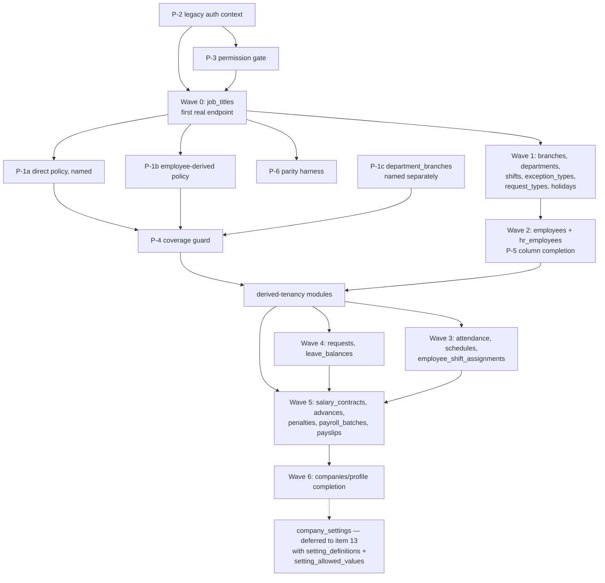

# Item 12 — Specification: Remap Built Java Functionality onto the Legacy MariaDB Contract

## Status

**Specification proposed. D-1 and D-4 were settled by the repository owner on
2026-08-18; D-2, D-3, D-5 and D-6 remain open.**

**No implementation has been done, and none may begin** until this specification
and the four remaining decisions are explicitly approved.

This is a planning artifact, per this repository's [`CLAUDE.md`](../../CLAUDE.md)
boundary. It specifies punch-list item 12
([`2026-08-17-phase1-punch-list.md`](2026-08-17-phase1-punch-list.md)) and
answers ADR-0011's open question — "whether Phase 1 delivers all 38 modules in
one release or several internal milestones... the engineering sequence within
it is not yet fixed."

## Scope boundary

This document proposes an **engineering sequence only**. It does not change the
production migration strategy: Phase 1 still cuts over the complete Java backend
as one replacement against the same MariaDB database (ADR-0011, D-040).

Explicitly out of scope, and untouched below:

- redesigning the Phase 2 target schema;
- resuming PostgreSQL/ETL work (frozen in `phase2Test` per D-040);
- introducing ADR-0010's Phase 3 canonical-permission model (Phase 1 stays on
  D-044's raw `hr_permissions` column port);
- item 13 (the 19 legacy modules with no Java counterpart at all).

## Method

Discovery was run against `hr-platform` @ `a2e8143` (current `main`) and the
`hr-legacy` working copy, comparing the 31 PostgreSQL JPA entities against the
vendored legacy contract at
`backend/src/test/resources/legacy/mysql_workin.schema.sql` — the same file
`scripts/check_legacy_schema_drift.py` proves byte-identical to `hr-legacy`.
Every count below is measured, not estimated.

---

## 1. Scope inventory

### 1.1 The shared-table set

ADR-0011 recorded "20 shared names". That count is by **exact table name**, and
it undercounts by one: Java's `leave_balances` and legacy's `leave_balance` are
the same concept split by pluralisation. The real Item 12 surface is **21
tables**.

Tenancy column below is the single most important axis — see finding F-1.

| # | Java entity | Package | Legacy table | Legacy tenancy | Java/legacy cols | Legacy module (endpoints) |
|---|---|---|---|---|---|---|
| 1 | `Company` | `identity` | `companies` | **tenant root** | 4 / 21 | `company` (3) |
| 2 | `Employee` | `employees` | `employees` | direct `company_id` | 11 / 27 | `employees` (14), `hr_employees` (3) |
| 3 | `Branch` | `organization` | `branches` | direct `company_id` | 10 / 11 | `branches` (6) |
| 4 | `Department` | `organization` | `departments` | direct `company_id` | 5 / 6 | `departments` (5) |
| 5 | `JobTitle` | `organization` | `job_titles` | direct `company_id` | 6 / 7 | `job_titles` (5) |
| 6 | `Shift` | `organization` | `shifts` | direct `company_id` | 7 / 8 | `shifts` (5) |
| 7 | `ExceptionType` | `attendance` | `exception_types` | direct `company_id` | 3 / 6 | `attendance_exception_types` (5) |
| 8 | `RequestType` | `requests` | `request_types` | direct `company_id` | 8 / 9 | `request_types` (5) |
| 9 | `OfficialHoliday` | `holidays` | `company_official_holidays` | direct `company_id` | 5 / 5 | `company_official_holidays` (5) |
| 10 | `PayrollBatch` | `payroll` | `payroll_batches` | direct `company_id` | 7 / 8 | `payroll_batches` (10) |
| 11 | `CompanySettings` | `companysettings` | `company_settings` | direct `company_id` | 8 / 4 (EAV) | `company_settings` (6) — **deferred to item 13 (D-4)** |
| 12 | `DepartmentBranch` | `organization` | `department_branches` | **derived** via `department_id` | 4 / 2 | (within `departments`) |
| 13 | `Attendance` | `attendance` | `attendance` | **derived** via `employee_id` | 9 / 10 | `attendance` (15) |
| 14 | `EmployeeSchedule` | `schedule` | `employee_schedules` | **derived** via `employee_id` | 8 / 8 | `schedules` (3) |
| 15 | `EmployeeShiftAssignment` | `schedule` | `employee_shift_assignments` | **derived** via `employee_id` | 5 / 5 | (within `schedules`) |
| 16 | `LeaveRequest` | `requests` | `requests` | **derived** via `employee_id` | 13 / 14 | `requests` (7) |
| 17 | `LeaveBalance` | `requests` | `leave_balance` | **derived** via `employee_id` | 10 / 9 | `leave_balances` (10) |
| 18 | `Advance` | `advances` | `advances` | **derived** via `employee_id` | 9 / 17 | `advances` (8) |
| 19 | `Penalty` | `penalties` | `penalties` | **derived** via `employee_id` | 8 / 8 | `penalties` (7) |
| 20 | `SalaryContract` | `payroll` | `salary_contracts` | **derived** via `employee_id` | 17 / 18 | `salary_contracts` (5) |
| 21 | `Payslip` | `payroll` | `payslips` | **derived** via `employee_id` | 26 / 25 | `payslips` (6) |

**Totals**: 10 tables carry `company_id` directly, 1 is the tenant root, and
**10 do not carry it at all**. The 19 legacy modules these tables serve hold
**128 of the 200 legacy endpoint files**.

Row 11 (`company_settings`, 6 endpoints) is listed for completeness of the
shared-table analysis but is **out of Item 12's delivery scope** per D-4. Item
12 therefore delivers 20 tables and 122 endpoint files.

### 1.2 What Item 12 can build on

Already merged and proven against real MariaDB (items 1–11, PR #100/#101):

- `LegacyEmployee` / `LegacyEmployeeRepository`, `LegacyCompany` /
  `LegacyCompanyRepository` — the adapter pattern to copy.
- `LegacyValues` — `tinyint(1)` booleans, `'0000-00-00'` zero dates, and enum
  spelling conversion. Already solves most representation hazards below.
- `TenantScope`, `TenantFilter`, `TenantFilterActivator`,
  `TenantAwareJpaTransactionManager`, `NO_TENANT` sentinel.
- `LegacyTenantContextService` (trust-boundary re-derivation),
  `LegacyRefreshTokenService`, `LegacyLoginController`.
- `LegacyHrPermissionEnforcer` + `LegacyHrPermissions` (D-044 raw-column port).
- `phase1-mysql` profile, `PostgresPersistenceConfig` /
  `LegacyPersistenceConfig`, and `ProfileCoverageArchTest`.

---

## 2. Findings that change the shape of the work

These are measured facts, not hypotheses. Each is reproducible from the
vendored schema and the Java sources.

### F-1 — The single-condition tenant filter does not generalise (blocking)

`TenantFilter`'s javadoc states:

> Legacy names this column `company_id` on every tenant-owned table, so one
> condition covers all of them. That uniformity is a property of the legacy
> schema being adopted unchanged... and it is what makes a single filter viable
> at all.

**This is true only for the three tables built so far.** Verified against the
vendored schema, these 10 Item 12 tables contain no `company_id` column at all:

`advances`, `attendance`, `department_branches`, `employee_schedules`,
`employee_shift_assignments`, `leave_balance`, `payslips`, `penalties`,
`requests`, `salary_contracts`.

`TenantFilter.CONDITION` (`company_id = :companyId`) cannot be applied to any of
them — Hibernate would emit SQL referencing a non-existent column. Since
`TenantFilterCoverageTest` fails the build when a tenant-owned entity is
unfiltered, **the first derived-tenancy entity added will fail the build until a
second mechanism exists**. This is the gating prerequisite for 10 of 21 tables.

The good news: the derivation is near-uniform. Nine of the ten reach tenant
identity by the same one-hop path, `employee_id → employees.company_id`. Only
`department_branches` differs (`department_id → departments.company_id`).

### F-2 — No existing business controller or service runs under `phase1-mysql`

`BackendApplication` scans `NoScanMarker` (an empty root), so component scanning
is entirely delegated to the two persistence configs. `LegacyPersistenceConfig`
scans:

`com.workin.legacy`, plus `backend.identity`, `backend.security`,
`backend.tenancy`, `backend.config`, `backend.authorization`, `backend.i18n`.

The **13 domain packages are absent from that list**. Under `phase1-mysql`,
none of the 24 `/api/tenant/**` controllers or their services are loaded at all.
They are not "surviving behind an adapter" today — they do not exist in the
context. Only 16 classes carry `@Profile("!phase1-mysql")`, all in the six
scanned infra packages.

This means the phrasing "remap the remaining built modules" needs a decision it
does not currently contain: whether Item 12 **ports** logic into
`com.workin.legacy` (as items 9–11 did) or **generalises** the existing domain
services to run under both profiles. See D-1 in §12.

### F-3 — Domain services couple to two Postgres-only mechanisms

Every one of the 11 domain packages imports `AuthorizationContext`; 9 of 11 also
use `TenantSessionVariable`:

| Package | Files | Uses `AuthorizationContext` | Uses `TenantSessionVariable` | Membership-coupled files |
|---|---|---|---|---|
| `advances` | 8 | 2 | 1 | 0 |
| `attendance` | 21 | 5 | 3 | 0 |
| `companysettings` | 7 | 2 | 1 | 0 |
| `employees` | 8 | 2 | 1 | 0 |
| `holidays` | 7 | 2 | 1 | 0 |
| `members` | 16 | 3 | 1 | 7 |
| `organization` | 27 | 5 | 4 | 0 |
| `payroll` | 25 | 7 | 3 | 0 |
| `penalties` | 7 | 2 | 1 | 0 |
| `requests` | 23 | 6 | 3 | 1 |
| `schedule` | 15 | 2 | 1 | 0 |

- `TenantSessionVariable` issues `SELECT set_config('app.current_company_id', …)`
  — PostgreSQL-only, meaningless on MariaDB. Phase 1's equivalent is
  `TenantScope` + the Hibernate filter, already built.
- `AuthorizationContext` is the record `(identityId, membershipId, companyId, …)`
  with `hasPermission(String permissionKey)` — the ADR-0010 membership model,
  backed by `identities`, `tenant_memberships`, `membership_roles`,
  `membership_resource_scopes`. **None of those four tables exist in legacy.**
  Phase 1's authenticated principal is an `employee_id`, and its permission
  check is `hr_permissions`' 17 boolean columns (D-044).

So no domain service survives *literally* unchanged: each needs its context
parameter and permission check swapped, independent of persistence.

### F-4 — `company_settings` is incompatible in both directions

Already recorded in ADR-0011 and re-confirmed: Java's `company_settings` is one
row per company with six typed columns (`month_start_day`, `month_end_day`,
`weekly_off_days`, `overtime_rate`, `pay_overtime`, `monthly_leave_accrual`);
legacy's is an EAV join to `company_setting_values` keyed by
`setting_definition_id`. This is a genuine rewrite, not a remap, and it drags in
two legacy-only tables (`setting_definitions`, `setting_allowed_values`) that
are formally item 13 scope. **Resolved by D-4**: `company_settings` is removed
from Item 12 and lands in item 13 with those two tables, rather than leaking
item 13 schema into item 12.

### F-5 — The two hub tables have the largest column gaps

`companies` (4 Java cols vs 21 legacy) and `employees` (11 vs 27) are not
partial mappings by accident — legacy carries the authentication and onboarding
surface there (`password_hash`, `status`, `otp_verified`, `profile_completed`,
`token_version`, `join_request_status`, `employee_code`, `national_id`,
`hire_date`, `birth_date`, `gender`). Any endpoint returning a full legacy
employee or company payload needs columns the current adapter does not map.

### F-6 — Two legacy columns are database-generated

`leave_balance.remaining_days` (`GENERATED ALWAYS AS (total_days - used_days)
STORED`) and `salary_contracts.total`. Both must map read-only
(`insertable = false, updatable = false`). `LeaveBalance` already does this for
`remaining_days`; `SalaryContract` currently has **no** `total` column mapped at
all, and the Java `total` is absent from the entity — a write to it would fail.

### F-7 — A referential cycle exists between `departments` and `employees`

`departments.manager_id → employees.id` while `employees.department_id →
departments.id`. Benign for read adapters, but it means neither can be declared
"complete" before the other, and any eager `@ManyToOne` mapping across that pair
will need `FetchType.LAZY` or id-only mapping.

---

## 3. Representation differences to handle

Mostly already solved by `LegacyValues`; listed so no boundary re-discovers them.

| Class of difference | Where it occurs | Handling |
|---|---|---|
| `tinyint(1)` booleans | `job_titles.is_active`, `employees.is_active`, `employees.can_check_in_any_branch`, `employees.is_mobile_attendance_enabled`, `exception_types.is_active`, `penalties.applied_to_payroll` | `LegacyValues.toBoolean` / `fromBoolean` |
| `'0000-00-00'` zero dates | legacy date/datetime columns; 24 known defective rows (`hr-legacy#28/#29`) | Map column as `String`, convert via `LegacyValues.toDate`; **cannot** be handled at the JPA layer — the JDBC driver raises before conversion |
| MySQL `enum(...)`, lowercase | `advances.status`, `requests.status` (`pending`/`approved`/`rejected`), `payroll_batches.status` (`draft`/`finalized`), `salary_contracts.salary_mode` (`monthly`/`daily`) | `LegacyValues.toEnum` / `fromEnum`; do **not** use `@Enumerated(STRING)` against the legacy spelling |
| Generated columns | `leave_balance.remaining_days`, `salary_contracts.total` | read-only mapping (F-6) |
| Audit columns absent in Java | `created_at` / `updated_at` on 12 of 21 legacy tables | Decide per D-3: map read-only, or maintain |
| Java-only `company_id` | 9 entities carry a `company_id` the legacy table lacks | Dropped from the legacy entity; tenancy comes from the derived filter (F-1) |
| Naming | `leave_balances` vs `leave_balance`; `approver_membership_id` vs `approver_id` | Explicit `@Table` / `@Column` names |
| Unsigned integer keys | all legacy PKs are `int(10) UNSIGNED` | `Long` in Java (already the convention); negative `NO_TENANT` sentinel stays safe |
| EAV | `company_settings` | rewrite (F-4) |

---

## 4. What survives, and what needs real rework

| Layer | Verdict |
|---|---|
| DTOs / request-response records | **Mostly survive.** They are plain records with no persistence or authorization coupling. But legacy contract parity is judged against the PHP response shape, not the current DTO — each needs diffing against its legacy endpoint. |
| Validation annotations, i18n, error mapping (`ApiExceptionHandler`) | **Survive.** `backend.i18n` is already in the `phase1-mysql` scan list. |
| Pure calculation logic (payroll totals, attendance derivation, schedule expansion) | **Survives** — the highest-value reuse in Item 12, and the reason a port is not a rewrite. |
| Domain services (`AdvanceService`, `AttendanceService`, …) | **Need mechanical rework**: `AuthorizationContext` → legacy employee context; `TenantSessionVariable` → removed; concrete `…Repository` → legacy repository. Logic body largely intact. |
| Controllers | **Need rework**: route (`/api/tenant/**` → `/api/legacy/**`), context resolution, permission gate (`hasPermission(key)` → `can_*` flag). |
| `members` package (16 files, 7 membership-coupled) | **No legacy counterpart.** `tenant_memberships` / `membership_roles` / `membership_resource_scopes` do not exist in legacy. Not remappable — excluded from Item 12; its Phase 1 replacement is `hr_permissions` + `hr_employees`. |
| `identity` (`Identity`, `RefreshToken`) | **Already replaced** by `LegacyEmployee` + `legacy_refresh_tokens` (item 9). |
| `platformadmin` | **Out of scope** — no legacy equivalent, and it is not tenant-facing. |
| `companysettings` | **Deferred to item 13** (D-4). |

### 4.1 The reuse constraint attached to D-1

D-1 selects the `com.workin.legacy` port, but with an explicit limit recorded by
the owner on 2026-08-18:

> Phase 1 controllers, application orchestration, persistence, and security
> wiring may be legacy-specific. Proven business logic must **not** be
> duplicated. Where logic is genuinely storage-independent and parity-proven,
> extract or reuse it as pure shared logic rather than maintaining two
> implementations.

Operationally, for every module PR:

- **Legacy-specific, duplicated deliberately**: controller, route, DTO
  assembly to the legacy payload shape, repository/entity, permission gate,
  tenancy policy selection.
- **Extracted and shared, never re-implemented**: calculation and rule logic
  that takes values in and returns values out — payroll arithmetic, attendance
  derivation, schedule expansion, leave accrual. These move to a pure,
  dependency-free class both profiles call.
- **The test that keeps this honest**: extracted logic keeps its existing
  PostgreSQL-profile unit tests *and* gains legacy parity tests. If a rule needs
  a second implementation to satisfy legacy, that is evidence of a behavioural
  difference (U-2) and must be recorded, not forked silently.

---

## 5. Shared prerequisites

These are the multi-consumer building blocks. Each unlocks many tables, and
each is why a table-by-table order would be wrong.

| ID | Prerequisite | Unlocks | Why shared |
|---|---|---|---|
| **P-1a** | **Direct tenancy policy** — today's `company_id = :companyId` condition, renamed and documented as *one* named policy rather than "the" filter | 10 of 21 tables | F-1. Making it explicitly one policy among several is what stops the next table being forced through it. |
| **P-1b** | **Employee-derived tenancy policy** — a **separate** `@FilterDef` scoping via `employee_id IN (SELECT id FROM employees WHERE company_id = :companyId)` | 9 of 21 tables | F-1. Nine tables share this exact one-hop path. Owner decision 2026-08-18: a distinct policy, not a parameterisation of P-1a. |
| **P-1c** | **`department_branches` — the remaining case, named and handled on its own** | 1 table | Reaches tenancy via `department_id → departments.company_id`, not `employee_id`. Owner decision 2026-08-18: identify it separately; do **not** force it through a generic filter. |
| **P-2** | **Legacy authorization context** — a per-request record carrying `employeeId` + `companyId`, resolved from the authenticated legacy JWT, replacing `AuthorizationContext` | every module | F-3. Partially exists inside `LegacyTenantContextService`; needs promoting to a reusable request-scoped component. |
| **P-3** | **Permission gate helper** — a uniform way for a legacy controller to require a `can_*` flag | every module | `LegacyHrPermissionEnforcer` exists; needs a call-site convention (D-044 forbids an annotation/interceptor shape). |
| **P-4** | **Coverage guard extension** — `TenantFilterCoverageTest` must require every tenant-owned entity to declare *exactly one* named policy (P-1a/P-1b/P-1c) and still fail closed | every module | Otherwise the guard silently accepts an unfiltered derived-tenancy entity, or one carrying a policy that does not match its columns. |
| **P-5** | **Employee/company column completion** — extend `LegacyEmployee` / `LegacyCompany` to the columns endpoints actually return | most modules | F-5. |
| **P-6** | **Parity harness** — a reusable way to assert a Java response equals the legacy PHP endpoint's shape | every module | Otherwise "contract parity" is asserted per-PR by eye. |

---

## 6. Dependency graph

Hard ordering constraints, from real foreign keys:

- `employee_shift_assignments.shift_id → shifts`; `attendance.exception_type_id
  → exception_types`; `requests.request_type_id → request_types`;
  `job_titles.department_id → departments`; `department_branches → departments +
  branches`. **Org masters precede their consumers.**
- `payslips.batch_id → payroll_batches`, and payslip figures aggregate
  `salary_contracts`, `advances`, `penalties`, and attendance-derived days.
  **Payslips are last in the payroll cluster.**
- Request approval mutates `leave_balance.used_days`. **`requests` and
  `leave_balances` land together or in that order.**
- `departments.manager_id ↔ employees.department_id` is a cycle (F-7) — map ids
  only, no eager association.

---

## 7. Recommended build order

Ranked against the owner's five criteria: shared dependencies first, then
unlocked downstream work, then risk, then reuse of the proven pattern, then
provability on real MariaDB.

| Wave | Content | Rationale |
|---|---|---|
| **0** | `job_titles` end-to-end + P-2, P-3, P-6 | Smallest real business module that exercises the whole path. Direct `company_id`, so it needs **no** new tenancy mechanism; `can_job_titles` already exists; 5 endpoints; one `tinyint(1)` and one timestamp. Closes the PR #101 evidence gap (§9) at the earliest possible point and fixes the module template before it is copied 18 times. |
| **1** | `branches`, `departments` (+`department_branches`), `shifts`, `exception_types`, `request_types`, `company_official_holidays` | All direct-`company_id` CRUD masters reusing the Wave 0 template unchanged. 32 endpoints. Every later wave has FKs into these. `department_branches` is **not** employee-derived; it needs P-1c and moves to Wave 2 alongside the tenancy policies. |
| **2** | **P-1a + P-1b + P-1c + P-4**, then `employees` + `hr_employees` with P-5, and `department_branches` | The tenancy policies gate everything after. Landing them with `employees` is deliberate: `employees` is the join target of P-1b, so the mechanism and its join target are proven together. `department_branches` lands here because it is the sole P-1c consumer. 17 endpoints. |
| **3** | `attendance` (+`exception_types` consumers), `employee_schedules`, `employee_shift_assignments` | First derived-tenancy consumers. `attendance` is the largest single module (15 endpoints) and the richest calculation logic to reuse. |
| **4** | `requests`, `leave_balances` | Coupled by the approval side effect on `used_days`. 17 endpoints. `approver_id` vs `approver_membership_id` is resolved here. |
| **5** | `salary_contracts` → `advances` → `penalties` → `payroll_batches` → `payslips` | Strict FK/aggregation order. Highest business risk (money), so it goes after the pattern is proven six times. `salary_contracts.total` (F-6) and `advances`' 9 unmapped `deduction_*` columns are resolved here. 36 endpoints. |
| **6** | `companies` / `profile` column completion | The last hub-table gap (F-5). Isolated at the end so it never blocks the mechanical waves. **`company_settings` is no longer here** — D-4 moved it to item 13. |

Rationale against criterion 2 (downstream unlock): Wave 0+1 unlock every later
wave's FK targets; Wave 2's P-1 unlocks 10 tables at once. Against criterion 3
(risk): payroll is deliberately last; against criterion 5, every wave is
provable against real MariaDB because each ends in HTTP-level tests.

---

## 8. Proposed branch and PR boundaries

One PR per row. Each is independently reviewable, independently revertible, and
ends green on CI.

| PR | Branch | Contents | Tests that must pass before merge |
|---|---|---|---|
| 12.1 | `phase1/item12-job-titles-first-module` | P-2, P-3, P-6, `LegacyJobTitle` + repository + service + controller under `/api/legacy/job_titles/**` | Real-MariaDB adapter test; **full-path E2E** (login → JWT → `TenantScope` → filter → `can_job_titles` → repository) per §9; cross-tenant denial; permission-denied (403); `phase1-mysql` off ⇒ default profile unaffected |
| 12.2 | `phase1/item12-tenancy-policies` | **Standalone security-mechanism PR** (owner-accepted 2026-08-18). P-1a, P-1b, P-1c and P-4 only — no modules. Corrects `TenantFilter`'s disproven javadoc claim (U-1) | Each policy returns zero rows unscoped (fail-closed) — asserted per policy, not once; coverage guard fails the build when a tenant-owned entity declares no policy **or the wrong one for its columns**, verified against the mistake as `TenantFilterCoverageTest` was; forged-claim isolation test extended to one P-1b table and to `department_branches` |
| 12.3 | `phase1/item12-org-masters` | `branches`, `departments`, `shifts`, `exception_types`, `request_types`, `company_official_holidays` (all direct-tenancy, P-1a) | Per-module adapter + E2E parity; FK integrity across the org set; the `departments ↔ employees` cycle mapped id-only |
| 12.4 | `phase1/item12-employees` | P-5 + `employees`, `hr_employees`, and `department_branches` (sole P-1c consumer) | Column-completion parity vs legacy payload; zero-date rows readable; P-1b proven through its join target; P-1c proven on `department_branches` |
| 12.5 | `phase1/item12-attendance-schedules` | `attendance`, `employee_schedules`, `employee_shift_assignments` | Calculation-parity tests vs legacy; derived tenancy on three tables; timezone handling unchanged |
| 12.6 | `phase1/item12-requests-leave-balances` | `requests`, `leave_balances` | Approval side effect on `used_days`; generated `remaining_days` read-only; `approver_id` mapping |
| 12.7 | `phase1/item12-payroll-contracts-advances-penalties` | `salary_contracts`, `advances`, `penalties` | `total` generated-column read-only; `deduction_*` columns mapped; money arithmetic parity |
| 12.8 | `phase1/item12-payroll-batches-payslips` | `payroll_batches`, `payslips` | End-to-end payroll run parity against a seeded legacy fixture; aggregation across four upstream tables |
| 12.9 | `phase1/item12-companies-profile` | `companies` / `profile` column completion (F-5) | Legacy company payload parity; onboarding/status columns readable; tenant-root behaviour unchanged |

PR 12.2 is deliberately mechanism-only, and the owner accepted it as a
standalone security PR on 2026-08-18: it is the one change that can silently
weaken tenant isolation across ten tables, and it must be reviewable without
module noise around it.

`company_settings` has **no PR in this list** — D-4 moved it to item 13, where
it lands together with `setting_definitions` and `setting_allowed_values` rather
than leaking item 13 schema into item 12.

---

## 9. Closing the PR #101 evidence gap, in PR 12.1

The gap, as item 9/10/11 recorded it: every isolation and permission proof so
far terminates at a **test-only probe controller**
(`LegacyIsolationProbeController`), because no real legacy business endpoint
exists. Nothing yet proves the composed path end to end.

`job_titles` closes it at the first opportunity because it needs no new
mechanism: direct `company_id`, an existing `can_job_titles` flag, and 5
endpoints.

The proof obligation for PR 12.1 — one test, real HTTP, real MariaDB,
`phase1-mysql` active, **no probe controller anywhere in the path**:

1. `POST /api/legacy/auth/login_employee` with seeded legacy credentials →
   a real JWT.
2. That JWT on `GET /api/legacy/job_titles` → `legacySecurityFilterChain`
   authenticates it.
3. `LegacyTenantContextService` re-derives the tenant from the employee row,
   not from the token claim.
4. `TenantAwareJpaTransactionManager` binds the filter for the transaction.
5. `LegacyHrPermissionEnforcer` requires `can_job_titles`.
6. `LegacyJobTitleRepository` returns only that company's rows.

Plus the three negative cases on the same real endpoint: a forged `tenant_id`
claim reads zero rows; an employee with `can_job_titles = 0` gets 403; a second
company's job titles are never visible.

Once this passes, `LegacyIsolationProbeController` should be deleted in the same
PR — its purpose is served.

---

## 10. Parity tests required at every boundary

**Execution rule (owner decision, 2026-08-18, from U-2).** Existing Java service
logic is **not** assumed to match legacy PHP merely because the module already
exists. Every module must establish behavioural parity against legacy evidence
and MariaDB-backed tests before it counts as remapped. "The entity already
existed" is not evidence; a cited PHP source location plus a passing
MariaDB-backed parity test is. A module whose parity cannot be established is
reported as such, not quietly marked done.

Applies to each module PR, not just the first:

- **Adapter-level**, against real MariaDB via `AbstractLegacyMySqlTest`: every
  mapped column round-trips; zero dates read; `tinyint(1)` booleans; enum
  spellings; generated columns rejected on write.
- **Tenant isolation**: cross-tenant read returns zero rows; unscoped
  transaction returns zero rows (`NO_TENANT`), never all rows.
- **Permission**: the module's `can_*` flag denies by default and denies when 0.
- **Contract parity**: response shape diffed against the legacy PHP endpoint —
  field names, types, null representation, and status codes. This is the test
  class that does not exist yet and is P-6.
- **Default-profile regression**: the PostgreSQL profile and its existing suite
  stay green, proving the port changed nothing for Phase 2's frozen work.

---

## 11. Currently unproven assumptions

Recorded explicitly, per this repository's requirement to separate confirmed
fact from hypothesis.

| # | Assumption | Status |
|---|---|---|
| U-1 | `TenantFilter`'s "every tenant-owned table has `company_id`" | **Disproven** (F-1), and accepted as disproven by the owner on 2026-08-18. The javadoc is corrected in PR 12.2, which replaces the single filter with three named policies. |
| U-2 | Legacy business logic in PHP matches the Java service logic built against the redesigned schema | **Unproven, and promoted to a binding execution rule** (§10, owner decision 2026-08-18). Java services were written for the target model, not transcribed from PHP. Still the largest schedule risk in Item 12. |
| U-3 | Response shapes of current `/api/tenant/**` DTOs match legacy PHP payloads | **Unproven**, and unlikely by default. Needs P-6. |
| U-4 | The 24 known zero-date rows are the only defective legacy data | **Partially proven** (`hr-legacy#28/#29` inventory); not re-verified since. |
| U-5 | One-hop `employee_id → employees.company_id` is sufficient for all 9 derived tables | **Proven structurally** from the schema; not proven for soft-deleted or cross-company-transferred employees. |
| U-6 | `hr_permissions`' 17 flags cover all 128 endpoints in scope | **Unproven.** D-044 already records legacy's ~21-of-150 enforcement gap; some endpoints may have no flag at all. |

---

## 12. Decisions

### 12.1 Settled by the repository owner, 2026-08-18

| # | Decision | Outcome |
|---|---|---|
| **D-1** | Port into `com.workin.legacy`, or generalise the existing PostgreSQL-oriented beans to run under both profiles? (F-2) | **Port.** Preserves the clean profile boundary ADR-0013 established and keeps Phase 2's frozen code untouched (D-040). Constrained by §4.1: legacy-specific wiring may be duplicated, proven business logic may not — storage-independent, parity-proven logic is extracted and shared. |
| **D-4** | `company_settings` needs `setting_definitions` + `setting_allowed_values`, formally item 13 scope. Pull them in, or defer? | **Removed from Item 12.** It lands in item 13 together with its two dependency tables, keeping that dependency intact rather than leaking item 13 schema into item 12. |
| — | Should PR 12.2 be a standalone security-mechanism PR? | **Yes.** And direct tenancy, employee-derived tenancy, and the `department_branches` case are three explicitly named policies (P-1a/P-1b/P-1c), not one generic filter. |
| — | Status of U-2 | **Promoted to a binding execution rule** — see §10. |

### 12.2 Still open — required before Wave 0 may start

| # | Decision | Options | Recommendation |
|---|---|---|---|
| **D-2** | Derived tenancy: Hibernate `@Filter` subquery (P-1b), or a mandatory repository-level join? | Filter keeps enforcement in one place and preserves the fail-closed sentinel; a subquery per read has a cost on large tables (`attendance`, `payslips`). | Filter, with an indexed `employees(company_id)` check measured in PR 12.2 before it is copied. |
| **D-3** | `created_at` / `updated_at` on 12 legacy tables have no Java counterpart. Map read-only, maintain on write, or ignore? | Legacy PHP sets them. Ignoring them means Phase 1 writes rows legacy tooling sees as never updated. | Maintain on write — a behavioural decision, not mine to make. |
| **D-5** | Is `members` (16 files, ADR-0010 membership model) formally excluded from Phase 1, or does it need a legacy-shaped replacement? | Its four backing tables do not exist in legacy. | Exclude explicitly and record it, so its absence is a decision rather than an omission. |
| **D-6** | Acceptance threshold: what proves a module "done"? | ADR-0011 lists this as an open question. | Per-module: all §10 parity tests green, the execution rule satisfied with cited legacy evidence, and the legacy module's endpoint count fully served. |

**Gate**: no Wave 0 implementation begins until this specification is approved
and D-2, D-3, D-5 and D-6 are settled.

---

## Standing references

- Sequencing and scope: [`ADR-0011`](../adr/ADR-0011-phase-sequencing.md), D-040
- Tenant isolation posture: [`ADR-0012`](../adr/ADR-0012-phase-1-tenant-isolation.md), D-041
- MySQL-profile bootstrap: [`ADR-0013`](../adr/ADR-0013-phase1-mysql-profile-bootstrap.md), D-043
- `hr_permissions` enforcement shape: D-044
- Punch list: [`2026-08-17-phase1-punch-list.md`](2026-08-17-phase1-punch-list.md)
